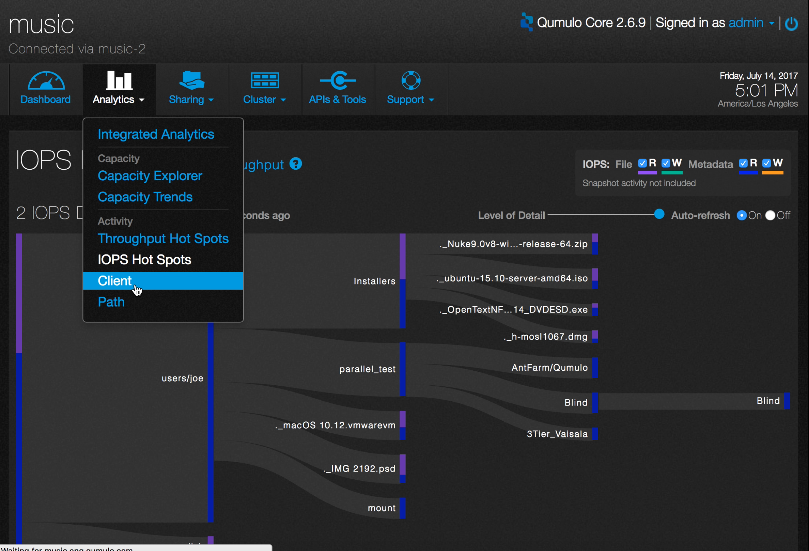
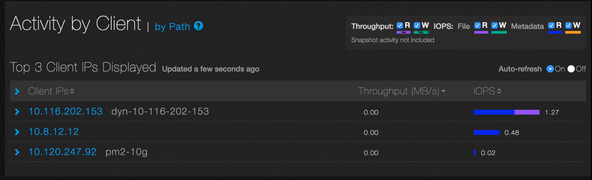
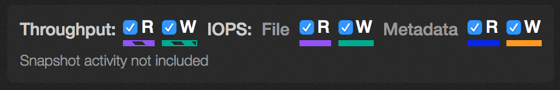
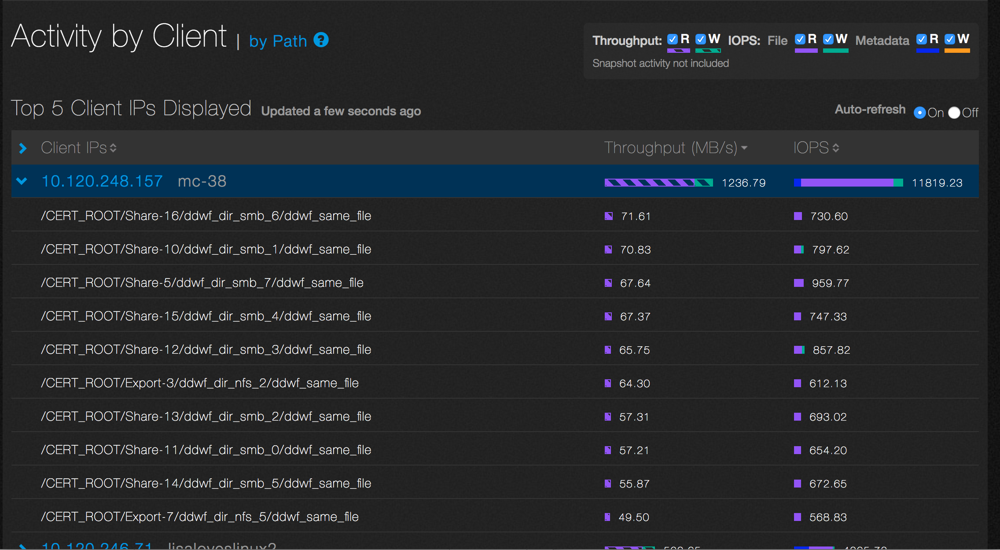
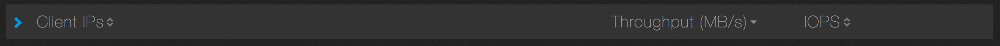

# Analytics Activity By Client

Analytics lets you see which clients are most active in terms of throughput and IOPS.

1. On the main dashboard, point to **Analytics** and click **Client**.

2. You will see a list of up to 40 of the most active clients in terms of throughput and IOPS. Here is an example.

For throughput, read operations are displayed as a striped purple bar and write operations as a striped green bar. For IOPS, read operations are displayed as a solid purple bar and write operations as a solid green bar. For metadata, read operations are displayed as a solid blue bar and write operations as a solid orange bar.

3. Each component can be independently selected by checking the corresponding buttons near the top of this display pane. In this example, all the components are selected. 

4. Click on the IP address or DNS name of a client to see up to 10 active paths. 

In this example, you can see the top ten active paths for the client at IP address 10.120.248.157.

5. By default, Client IPs, Throughput, and IOPS are sorted in descending order, as shown in the example. You can toggle between descending and ascending order by clicking on the appropriate header.

6. To pause the display, select the the “Auto-refresh Off” radio button. 

  

 
