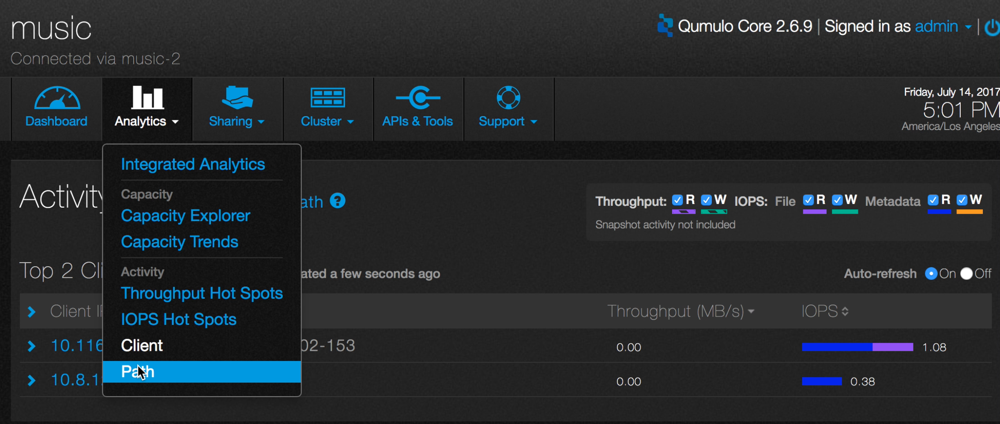
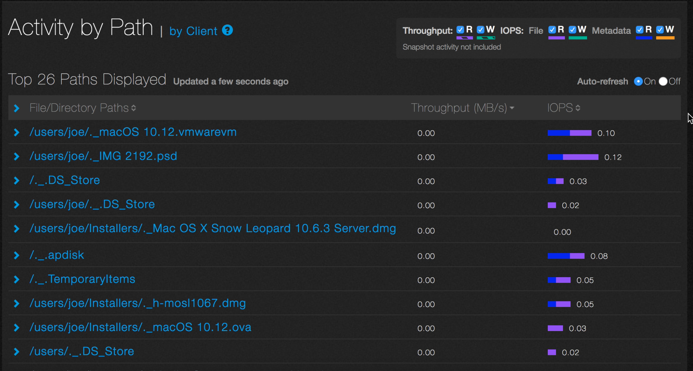
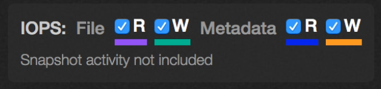
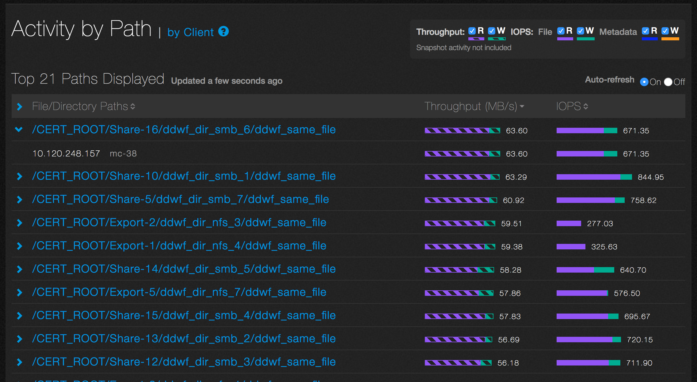
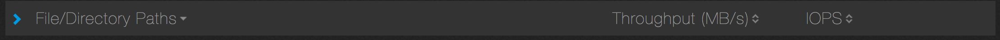

# Analytics Activity By Path

Analytics lets you see which paths are most active in terms of throughput and IOPS.

1. On the main dashboard, point to **Analytics** and click **Path**.

2. You will see a list of up to 40 of the most active paths in terms of throughput and IOPS. Here is an example.

For throughput, read operations are displayed as a striped purple bar and write operations as a striped green bar. For IOPS, read operations are displayed as a solid purple bar and write operations as a solid green bar. For metadata, read operations are displayed as a solid blue bar and write operations as a solid orange bar.  

3. Each component can be independently selected by checking the corresponding buttons near the top of this display pane. In this example, all the components are selected.

 

4. Click on a path to see the active client’s IP address and DNS name.

In this example, for the path, /CERT_ROOT/Share-16/ddwf_dir_smb_6/ddwf_same_file, the client at IP address 10.120.248.157 (mc-38), is the most active.

5. By default, File/Directory Paths, Throughput, and IOPS are sorted in descending order, as shown in the example. You can toggle between descending and ascending order by clicking on the appropriate header. 

6. To pause the display, select the  **Auto-refresh Off** radio button.

 

  

