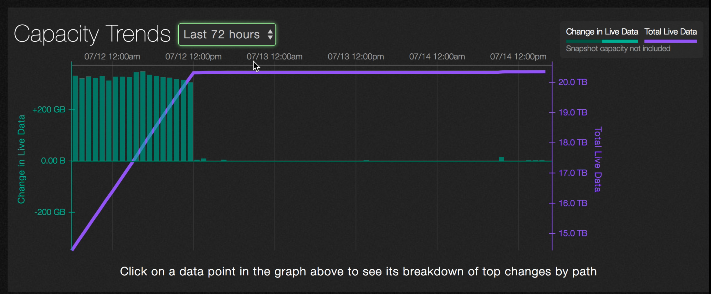

# Analytics &mdash; capacity trends

Analytics gives you a picture of the capacity trends in your system over time, but not every file and directory can be visualized when there are large numbers of them. For example, think about how difficult it would be to represent a directory that has millions of files and/or subdirectories.  

Instead, if a child directory’s capacity change is 90% or more of the parent’s capacity change then it is shown. If the leftover capacity change is large enough, that too is shown. If there are many changes to a directory, then the largest ones are shown. For example, if /foo/bar/ has a change of +4GB and /foo has a change of +4.1GB, then /foo/bar will be shown on the graph.
 
If the capacity change for a directory is greater than 1% of the overall capacity change, then it is displayed.

1. On the main dashboard, point to **Analytics** and click **Capacity Trends**.

2. You will see a graph that shows the capacity used by the file system over time. 

The green bars represent changes in capacity over time. The purple line charts total data consumed in the file system over time. The graph automatically scales as usage changes.

3. You can change the time period to be the last 72 hours, the last 30 days, or the last 52 weeks. 

Here is an example of a graph that shows  the last 72 hours.

4. Hover over a green bar to show the time period, change in size and amount of data consumed (or released).

5. Click on a data point to see details about the specific paths that were involved with the change in capacity.

