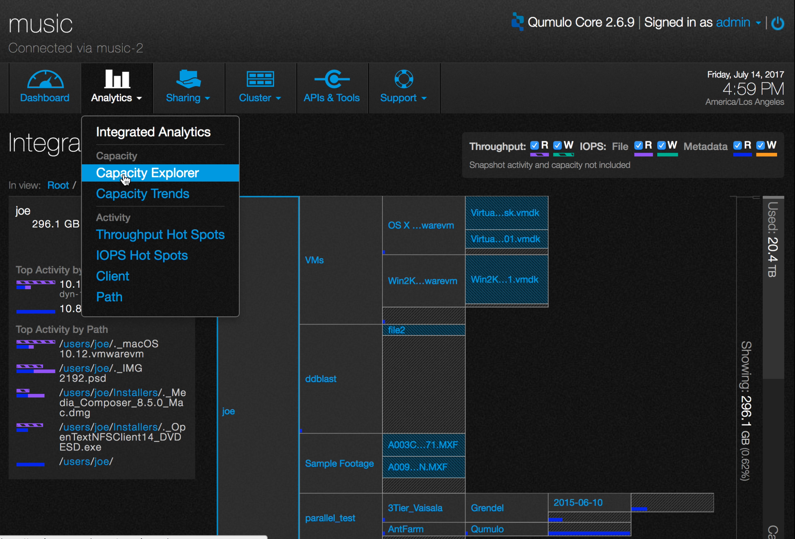
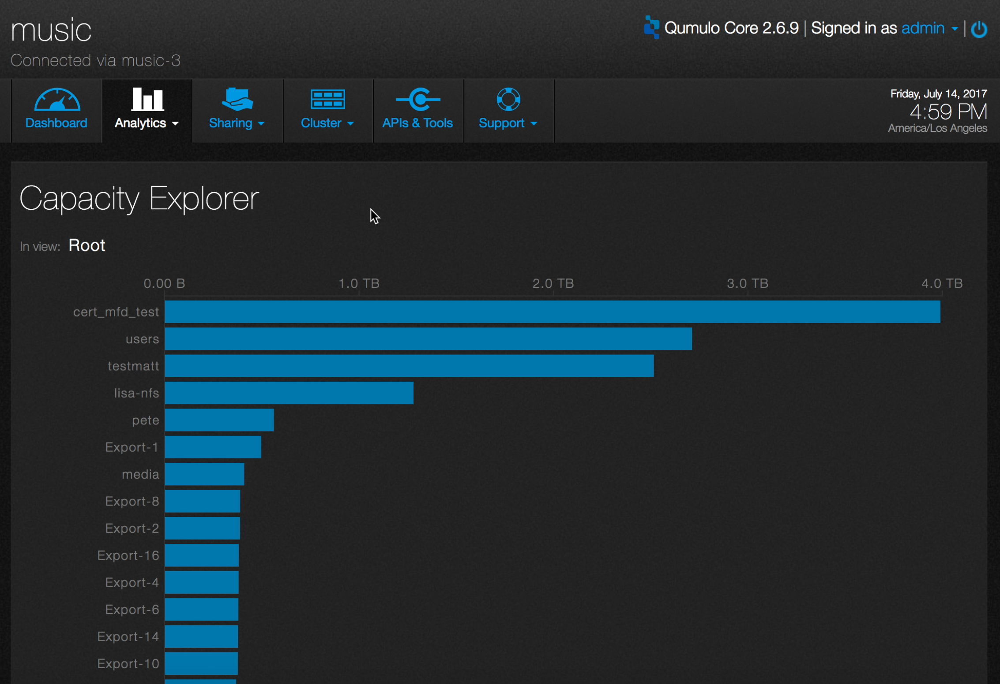
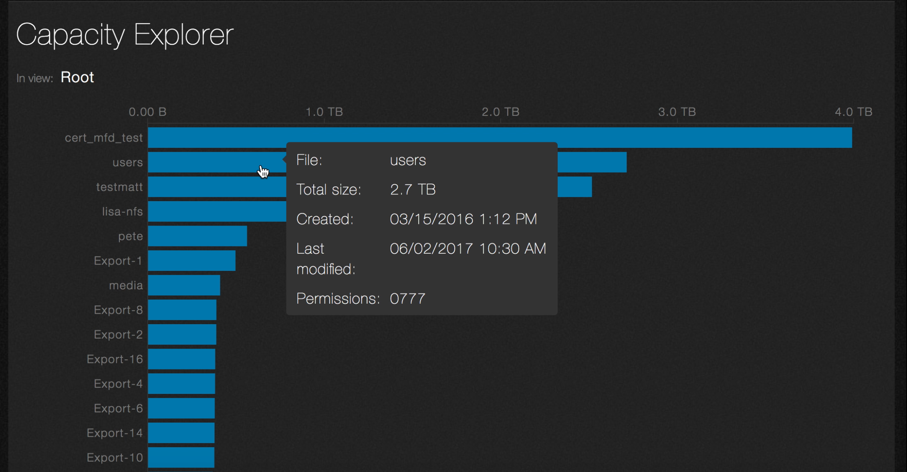
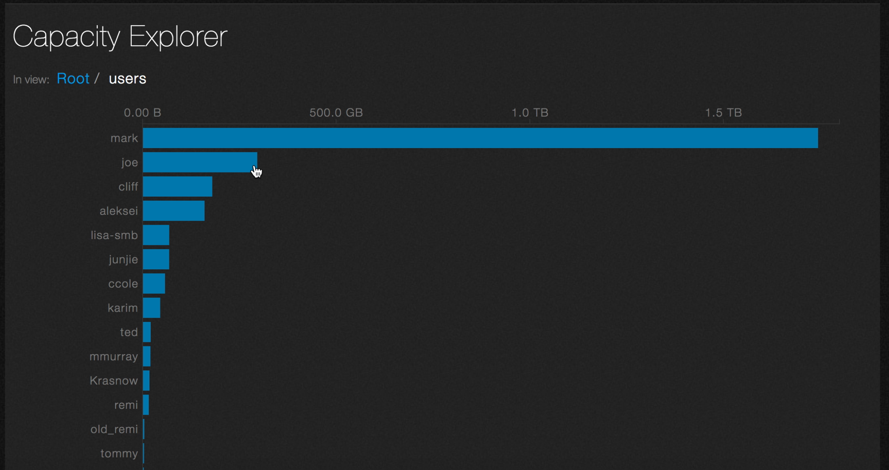
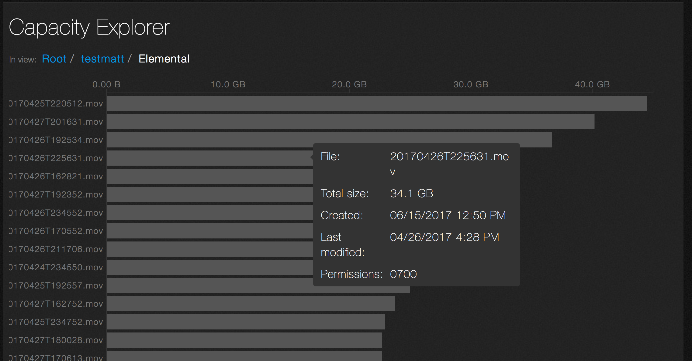

# Analytics &mdash; capacity explorer
Analytics lets you see how capacity is used on your system.

1. On the main dashboard, point to **Analytics** and click **Capacity Explorer**.

    

2. The lower window changes to a hierarchical view of capacity.

    

    The directories are listed from largest to smallest.

3. To see file system details, hover over a directory with the mouse.

    

4. Click on a directory. The bar graph expands with information about the files it contains. In this example, the screenshot shows the subdirectories contained in the directory named **users**.

    

5. You can continue to click on directories until you ultimately reach detail at the file level.

    

