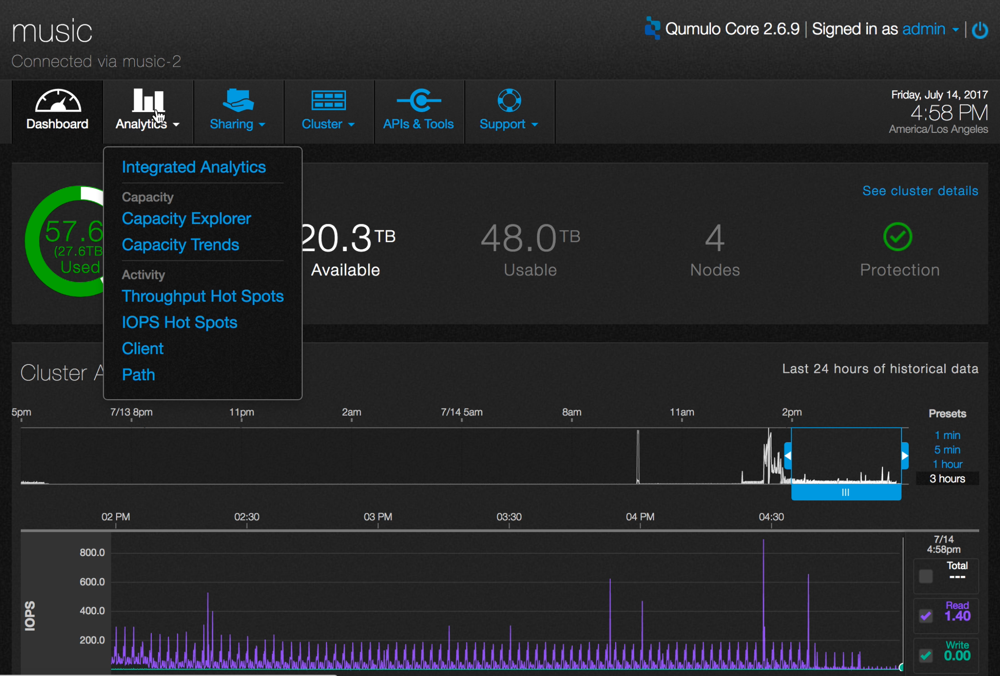
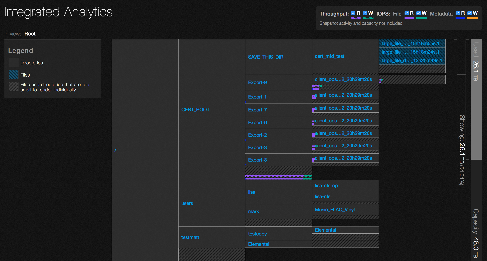
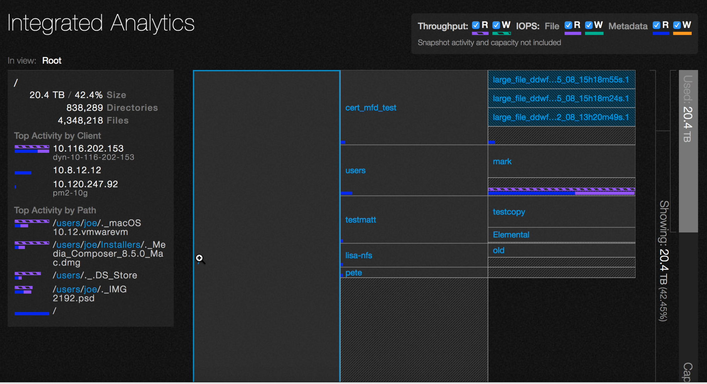
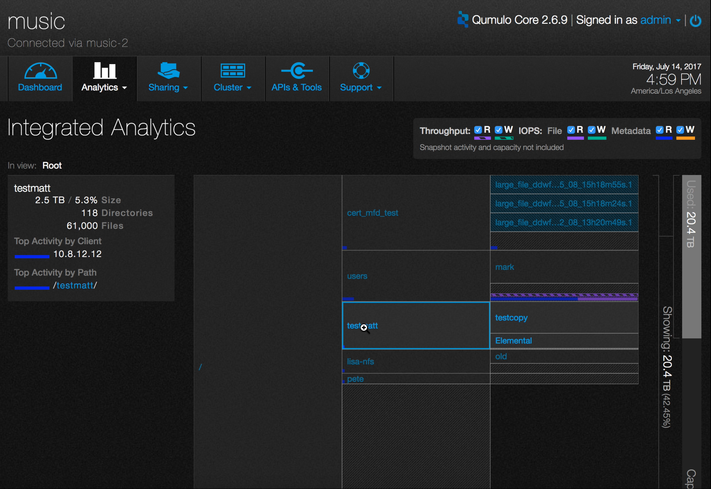
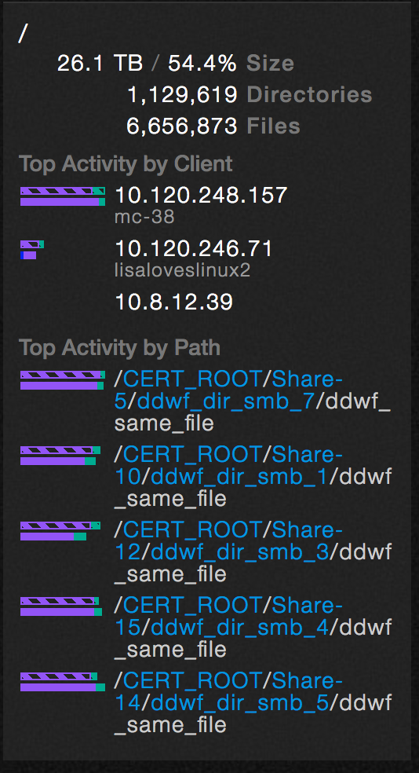
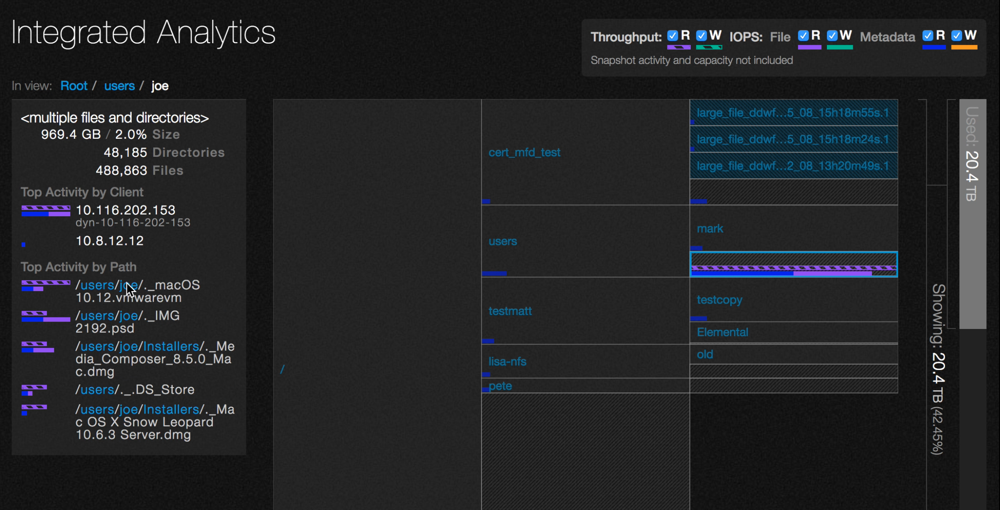
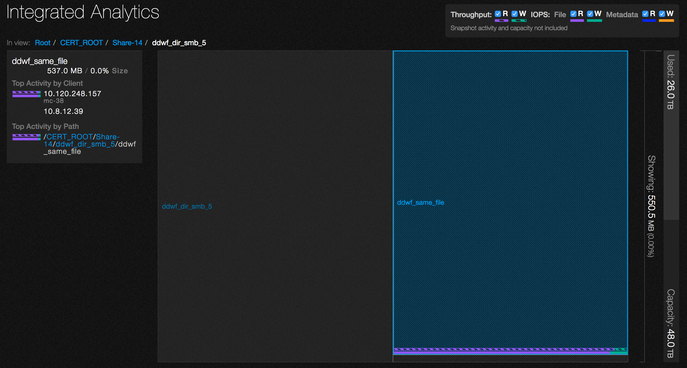

# Analytics &mdash; integrated analytics 

Analytics has a central dashboard that gives you an overview of what’s happening in your storage system.

1. On the main dashboard, point to **Analytics** and click **Integrated Analytics**.

2. The view changes  to a hierarchical block diagram of the file system contents.

3. If you click on a specific directory, the information pane to the left becomes populated with statistics about a particular path in the file system. The file system tree in the right pane updates.  Click on the root of the file system, **/** to get more detailed information.

4. The size, number of directories, and number of files is generated in real time. This information also updates concurrently as the file system changes.

5. Click on another path in the right hand pane to produce details for that directory.

6. Note how the details in the left pane automatically update. The **Top Activity by Client** section lists the most active clients connected to the cluster and displays the path, IP address and DNS name, if available.

The **Top Activity by Path** section lists the most active directories.

7. Click on one of the listed paths. The display updates to the selected directory and shows the same details as before for the specific selected path.

8. Click on an active file to drill down to details about it. 

 

 
