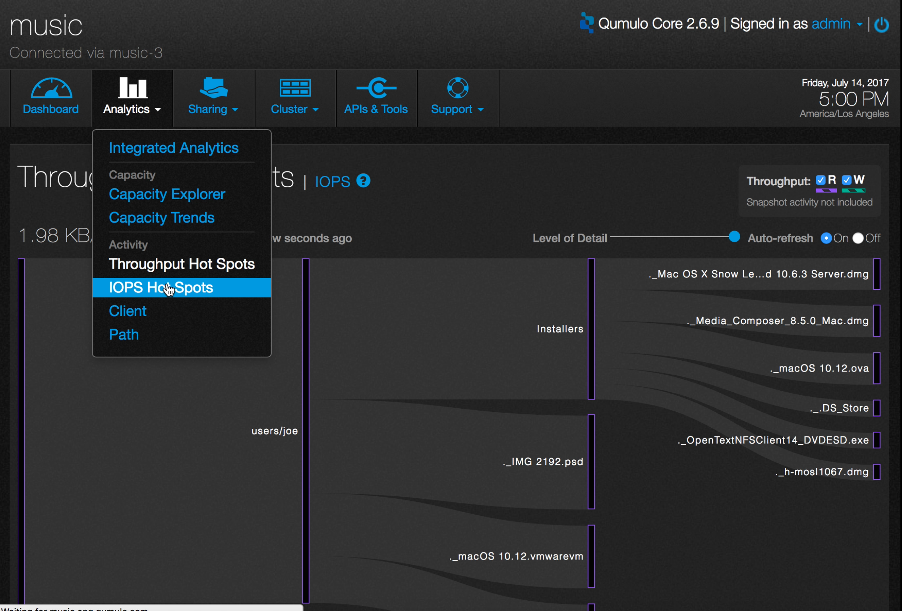
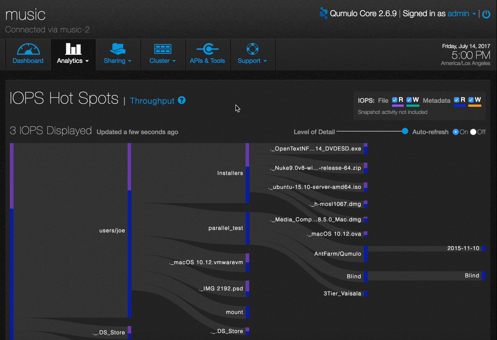
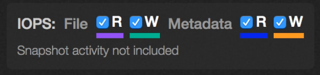
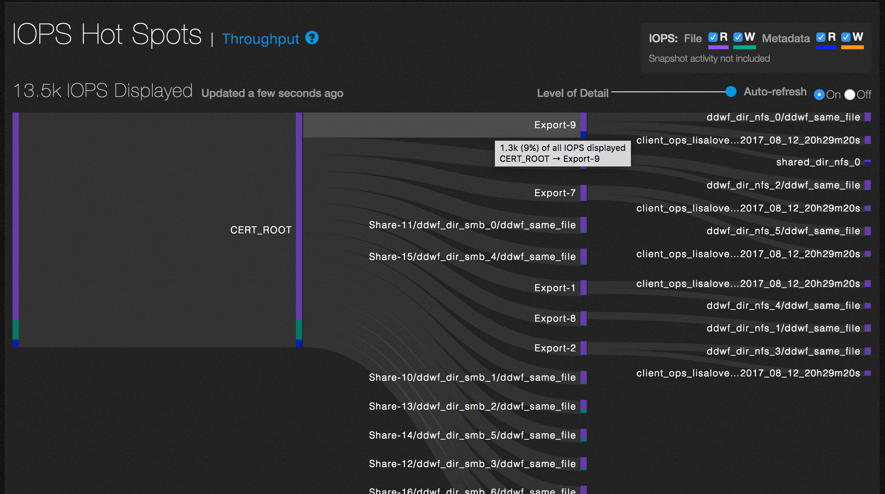
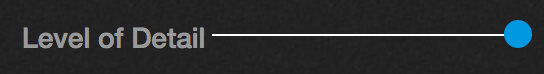
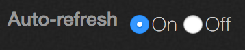

#Analytics &mdash; IOPS Hot Spots

Analytics lets you identify the IOPS (input/output per second) hot spots in your storage system.

1. On the main dashboard, point to **Analytics** and click **IOPS Hot Spots**.

2. You will see a graph of the most active IOPS in the file system.

The graph shows the most active directories in terms of read/write operations for files and metadata. File read operations are represented by purple bars and write operations are represented by green bars.  Metadata read operations are blue and write operations are orange.

3. You can see any combination of these operations by checking or unchecking the appropriate boxes in the upper right hand side. In this example, the graph shows all the operations.

4. To see additional detail about a directory, hover over it with the mouse.

In this example, hovering over /CERT_ROOT/Export-9 shows that it accounts for 9% (1.3K IOPS)  of the total cluster IOPS displayed.

5. To adjust the level of detail if the cluster is particularly active, use the slider.

6. To pause the display, select the Auto-refresh Off radio button.

