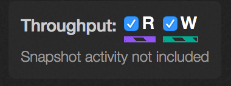

# Analytics &mdash;Throughput Hot Spots

Analytics lets you identify the throughput hot spots in your storage system.

1. On the main dashboard, point to **Analytics** and click **Throughput Hot Spots**.

2. You will see a graph of the most active directories, in terms of bandwidth throughput, in the file system.

The graph shows the read and/or write activity of the most active directories. Read activity is represented by purple striped bars and write activity is represented by green striped bars.

3. You can see just the read or write activity by unchecking the appropriate box in the upper right hand side. In this example, both activities are selected. 

4. To see additional detail about a directory, hover over it with the mouse.

In this example, hovering over /CERT_ROOT/Export-6 shows that it accounts for 9% (161 MB/s)  of the total file system throughput displayed.

5. If the cluster is particularly active, you can adjust the level of detail with the slider.

6. To pause the display, select the Auto-refresh Off radio button.

 
