# Continuous Replication

Continuous replication creates a copy of the data in a directory on your primary cluster and transfers it to a directory on a second, target cluster. Continuous replication is always running, unless you configure it to not run during certain hours of the day or days of the week. While continuous replication is running, QF2 will take your latest changes and replicate them without you needing to worry about which job they get scheduled into. QF2 supports a wide range of workloads from backing up business critical data to moving data to the cloud for access to more compute power. Continuous replication uses QF2 snapshots to generate a point-in-time consistent copy of the source directory on the target cluster.

There are some situations, such as periods of peak cluster use, where you may want to temporarily disable replication. The QF2 continuous replication UI provides the ability to create one or more *blackout windows* where replication will suspend operations until the blackout window expires, at which time replication will automatically resume operations. 

This tutorial requires that you have two active clusters. One cluster will be the source and the other will be the target.

## Open the replication page

1. Log in to the source cluster.
2. Point to **Cluster** and click **Replication**.

    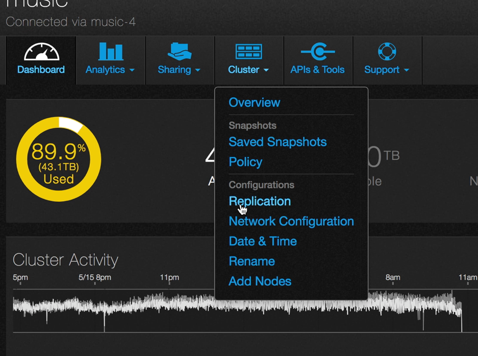

3. The **Replication** page opens. You see a list of current replication policies.

    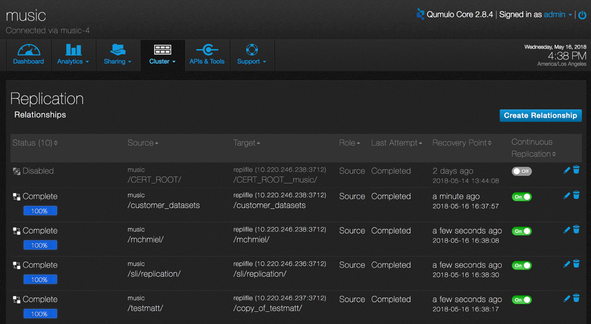

    Clicking the pen icon on the far right allows you to edit policy.

    

    Clicking the trash can icon on the far right will delete the policy.

    

4. Here is an explanation of the fields.

    * _Status_ indicates the last time the policy ran to completion. Any policies currently running will have a status of "Replicating..."
    * _Source_ is the source directory on the the source cluster.
    * _Target_ is the target cluster, IP address, port and target directory on the target cluster.
    * _Role_ specifies whether this cluster is a source or a target.
    * _Last attempt_ is the outcome of the last execution of the policy.
    * _Recovery Point_ is the time and date when the last replication job completed.
    * _Continuous Replication_ enables or disables the replication policy.

The policies can be sorted by clicking on any of the column headers.     

## Creating a relationship

Creating a relationship means that you create a relationship between a source and a target directory.

1. On the **Replication** page, click **Create Relationship**.

    

2. The **Create Relationship** page opens.

    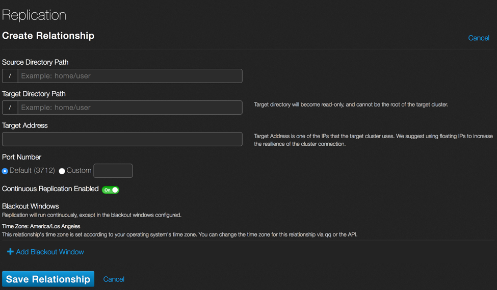

3. In the **Source Directory Path** field enter the file path of the directory you wish to replicate. The directory must already exist on this cluster.
4. In the **Target Directory Path** enter the file path on the target cluster to which you want to replicate data. The directory must already exist on the target cluster and it must be empty.
5. In the **Target Address** field enter the IP address of one of the nodes of the target cluster. Use floating IPs instead of static IPs to ensure resiliency.
6. For **Port Number**, QF2 uses a default port number of 3712. This can be overridden if necessary to meet enterprise network firewall rules. To override, select the Custom radio button and enter the port number.
7. Make sure that **Continuous Replication Enabled** is **On**. Toggling it to **Off** suspends replication for this relationship. 
8. Click **+ Add Blackout Window**. Blackout windows are times when replication between the source and target directories is suspended.

    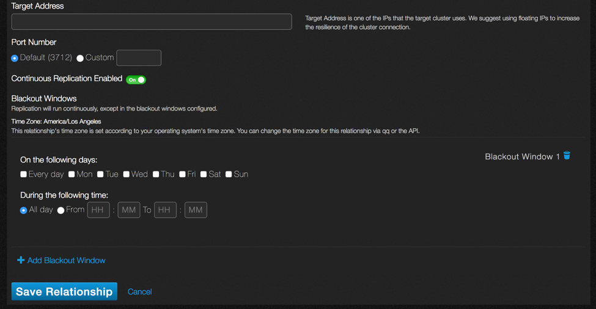

13. Select the day (or days) and times when there is no replication. For time, use a 24-hour clock for scheduling. After entering a valid start and stop time the UI will show you the duration of the window.
14. If you want to add another blackout window, click the **+** sign. You can add up to 10 blackout windows per relationship.

    Here is an example of a completed policy. 
    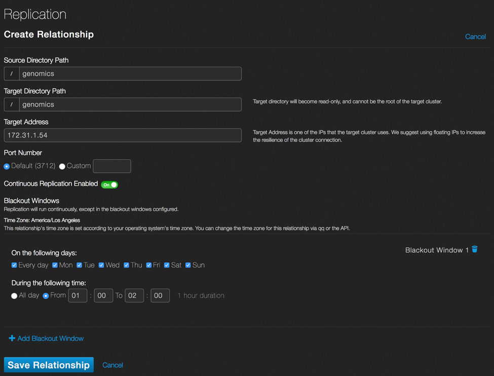

    The source directory on the originating cluster is named **genomics**. The target directory is set to **genomics** on the destination cluster. The IP address of one of the nodes on the target cluster is 172.31.1.54 Continuous replication is enabled but there is a blackout window from 1:00AM to 2:00AM every day.

15. Click **Save Relationship**.
16. The **Replication** page appears and shows the new relationship. Note that the status is **Awaiting Authorization**.

    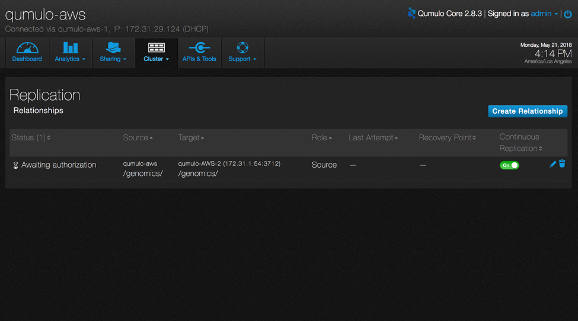
    

## Authorize a relationship
You must authorize a policy on the target cluster before replication can begin.

1. Log in to the target cluster.
2. Point to **Cluster** and click **Replication**. The new policy is listed with a status of **Awaiting Authorization**, along with an alert at the top of the list. 

    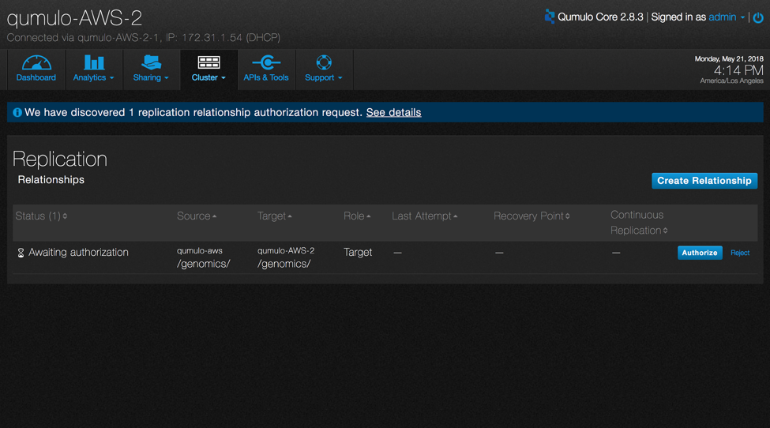

3. Clicking **Reject** will deny authorization while clicking **Authorize** will authorize the policy. Click **Authorize**.

       

4. If the target directory does not exist, you will see a warning.
    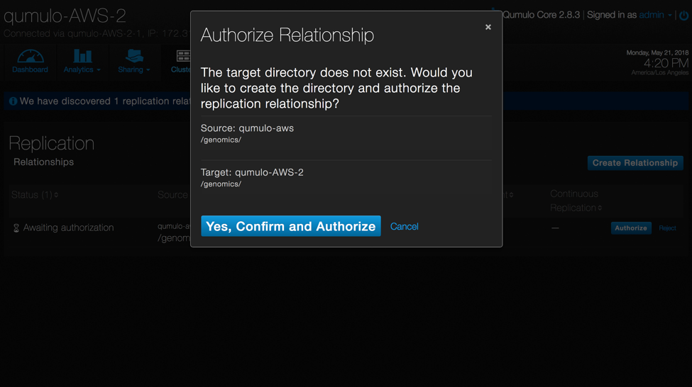
5. Click **Yes, Confirm and Authorize** to automatically create the directory.

## See the status

1. Go back to the source cluster **Replication** page. 
2. The status is now **Authorized**. 
3. Once a policy is authorized, replication begins automatically (unless you are in a blackout window.) The status changes to **Replicating** and data begins to be copied from the source directory to the target directory.
4. While the policy replicates, a progress bar shows the current percentage that is complete. 

    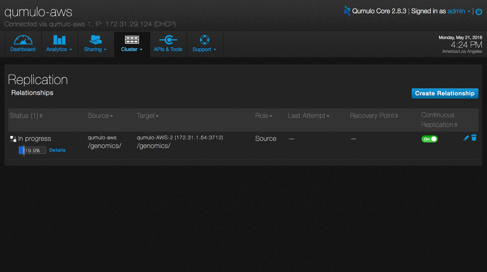

5. Click **Details** to see additional information about the progress, including data throughput (both instant and average), run time (elapsed and estimated remaining), and data (amount transferred unchanged, remaining, and total).

    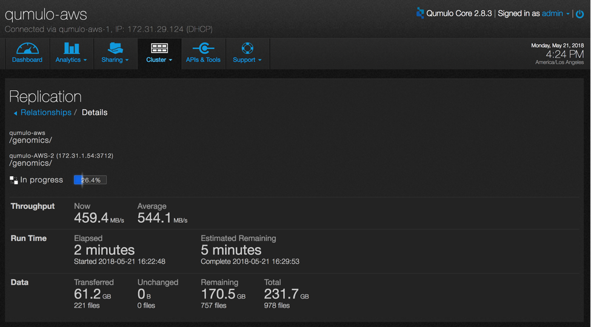

 6. Click **Relationships** to return to the policy summary screen.
 7. Once replication is complete, the **Recovery Point** column will show the time and date of the last successful replication.

     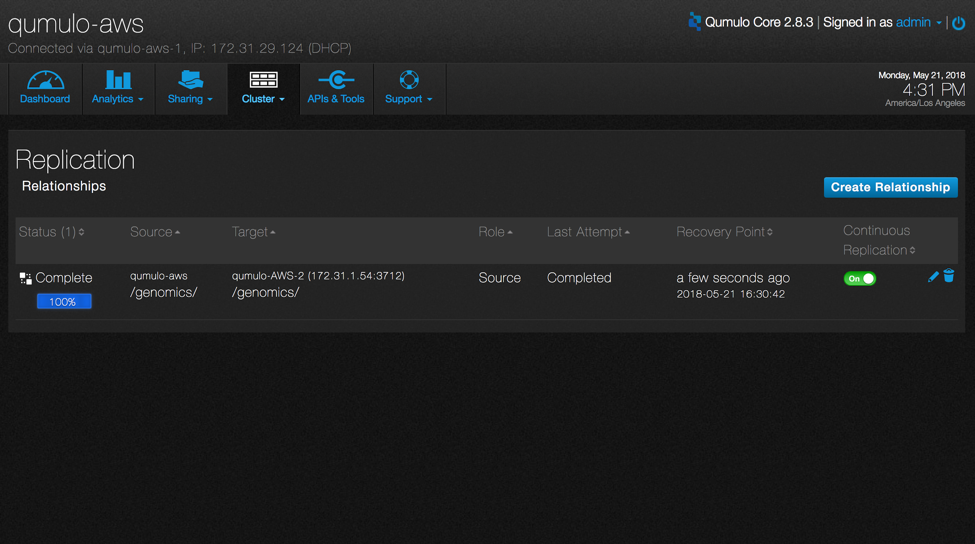   

8. The policy will continuously replicate data as it is updated on the source to the target, except during any blackout windows.

