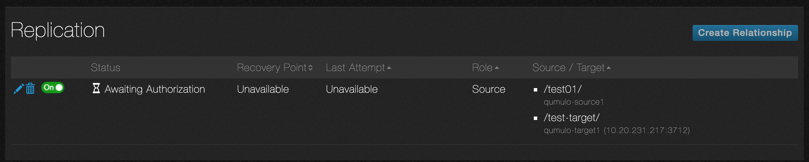
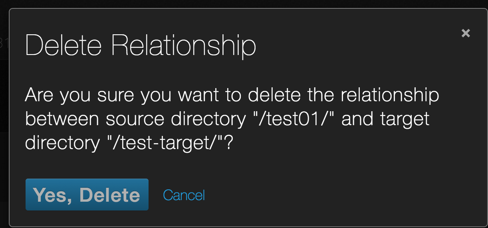

# Continuous Replication

Continuous replication creates a copy of the data in a directory on your primary cluster and transfers it to a directory on a second, target cluster. Continuous replication is always running, unless you configure it to not run during certain hours of the day or days of the week. While continuous replication is running, QF2 will take your latest changes and replicate them without you needing to worry about which job they get scheduled into. QF2 supports a wide range of workloads from backing up business critical data to moving data to the cloud for access to more compute power. Continuous replication uses QF2 snapshots to generate a point-in-time consistent copy of the source directory on the target cluster.

There are some situations such as periods of peak cluster use where you may want to temporarily disable replication. The QF2 continuous replication UI provides the ability to create one or more *blackout windows* where replication will suspend operations until the blackout window expires, at which time replication will automatically resume operations. 

This tutorial requires that you have two active clusters. One cluster will be the source and the other will be the target.

## Open the replication page

1. Log in to the source cluster.
2. Point to **Cluster** and click **Replication**.

    

3. The **Replication** page opens.

    

4. The page lists any existing relationships. In this example, there are none.

5. Click **Create Relationship**.

6. The **Create Relationship** page opens.

    

7. In the **Source Directory Path** field enter the file path of the directory you wish to replicate. The directory must already exist on this cluster.
8. In the **Target Directory Path** enter the file path on the target cluster to which you want to replicate data. The directory must already exist on the target cluster and it must be empty.
9. In the **Target Address** field enter the IP address of one of the nodes of the target cluster.
10. QF2 uses a default port number of 3712. This can be overridden if necessary to meet enterprise network firewall rules. To override, select the Custom radio button and enter the port number.
11. Make sure that **Continuous Replication Enabled** is **On**. Toggling it to **Off** suspends replication for this relationship. Here is an example that shows source and target directory paths and the IP address of the target cluster.

    

12. Scroll down to the **Blackout Windows** section. Blackout windows are times when replication between the source and target directories is suspended.

    

13. Select the day (or days) and times when there is no replication. For time, use a 24-hour clock for scheduling. After entering a valid start and stop time the UI will show you the duration of the window.
14. If you want to add another blackout window, click the **+** sign. You can add up to 10 blackout windows per relationship.
15. In this example, there are two blackout windows.

    

    The first blackout window occurs on Sundays from 22:00 to 23:00 (10PM to 11PM). The second blackout window occurs on Sundays from 9AM to 11AM.

16. Click **Save Relationship**.
17. The **Replication** page appears and shows the new relationship. It hasn't been authorized yet.

    
    
 18. The page shows the following information:

* **Status**. This column represents the current status of each relationship. The **Status** column will let you know if the relationship is **Replicating**, in a **Blackout Window**, **Awaiting Authorization** or another state.
* **Recovery Point**. This is a timestamp from the source cluster and represents the time QF2 took a snapshot of the source directory and began moving data across to the target. This timestamp is updated every time QFS successful completes the transfer of a new data set.
* **Last Attempt**. This states whether the last replication attempt completed or failed.
* **Role**. This column indicates whether the cluster is serving in the role of a source or target directory for the particular relationship.
* **Source / Target**. This shows the source directory and the target directory.

    Here is an example replication screen that shows multiple relationships with different statuses.

    

   
## Authorize a relationship

1. Log in to the target cluster.
2. You will see a notice that there is an authorization request. Click **See details**.

    

3. The **Replication** page appears. 

       

4. Click **Accept**. As soon as you do this, replication starts (unless you are in a blackout window or if replication for that relationship is turned off).
5. The **Status** column changes.

    

## See the status

1. Go back to the source cluster **Replication** page. You will see that the status has changed to **Replicating**.

    

2. Once any changes in the source directory have been copied to the target directory, the information on the **Replication** page changes again. Here is an example.

    

    The **Recovery Point** column shows 8 minutes. This means that the most recent snapshot was created on the source cluster eight minutes ago. The **Last Attempt** column shows that the transfer completed.

    During a blackout window, replication is temporarily halted and the status changes. Here is an example.

    

## Edit a relationship

1. You can edit an existing relationship on the source cluster. Click the **pencil** icon on the **Replication** page. 

    

2. The **Edit Relationship** page appears. Here is an example.

    

    Note that you cannot change the source and target directory paths. If you want to do this, you must create a new relationship.

# Delete a relationship

1. You can delete a relationship on either the source or target cluster. Click the **trashcan** icon next to the relationship you want to delete.

    

2. A confirmation dialog box appears. Click **Yes, Delete**.

    
     
    
