# Create a Qumulo File Fabric (QF2) virtual cluster on a Mac
(This procedure assumes that you've already downloaded the .ova file. If you haven't, go [here](/evaluate/download/vm).) 

In this tutorial, you’ll simulate an on-premises QF2 cluster by using virtual machines (VM). A cluster is a collection of nodes, where an on-premises node is a single hardware chassis. A node is simulated in the tutorial by a VM. An on-premises cluster requires a minimum of four nodes because of the way the block protection scheme works.

## System requirements
Here are the system requirements.

* For best performance, we recommend that your computer have at least 8GB of RAM and an SSD to host the virtual images.
* You need VMware Fusion installed.
* You need access to the Internet. 
* We recommend that you use the Chrome browser. The first time you access the cluster with the browser, you may get a warning that your connection is not private. If you do:
1. Scroll down and click **Advanced**.
2. Click **Proceed to *IP Address***
3. Log in to the cluster as admin.

## User requirements
The tutorial creates the virutal cluster with VMware Fusion. The application uses some defaults when it configures the nodes. For example, it assumes that DHCP is available, and it automatically powers on each instance. If you have other preferences, you need to understand VMware Fusion well enough to change its settings.

## Create a node

In this section, you create your first node.

1. Go to the directory where you downloaded the VMware .ova file and click on it.
2. VMware Fusion opens. Select the file and click **Continue**.

    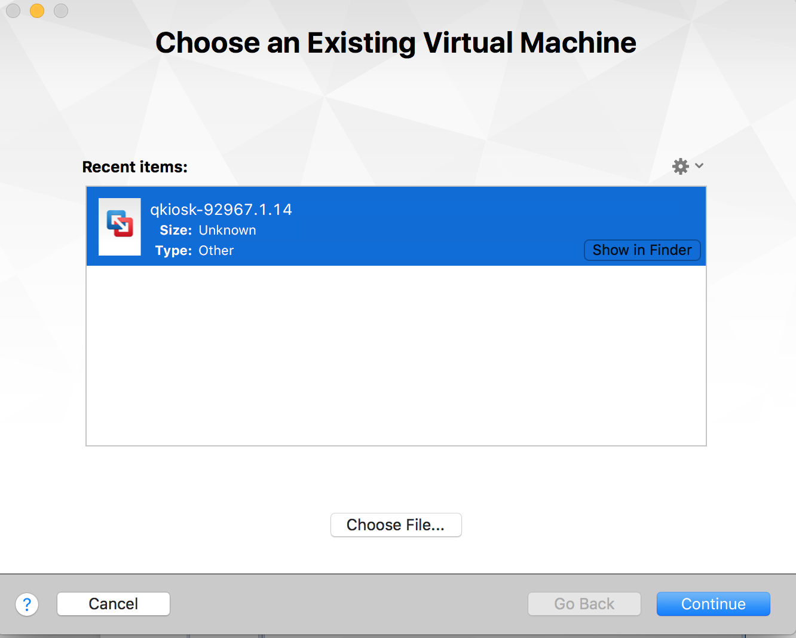

3. A dialog box opens.

    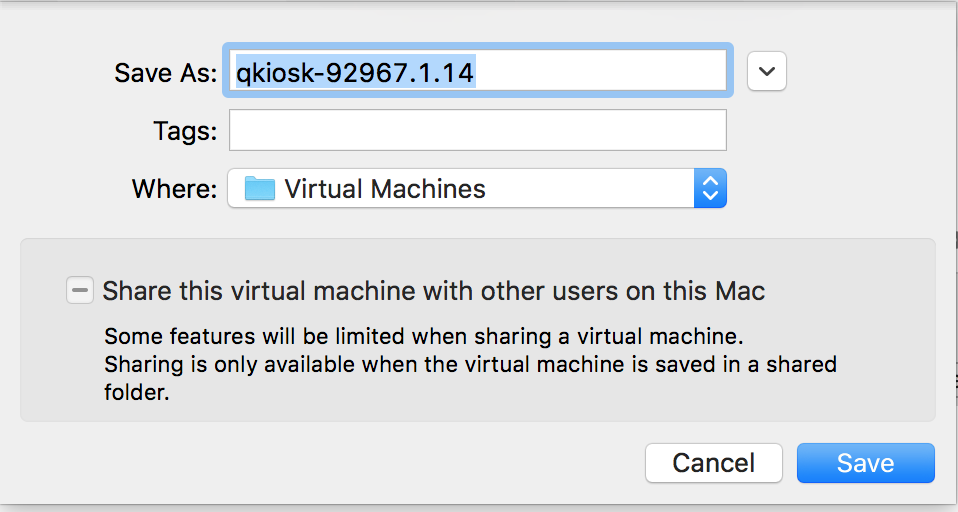

4. In the **Save As** field, use the default name. 
5. In the **Where** field either use the default path or enter a local storage path where you want to save the VM. If possible, save it on an SSD device.
6. Click **Save**. 
7. A warning message appears.

    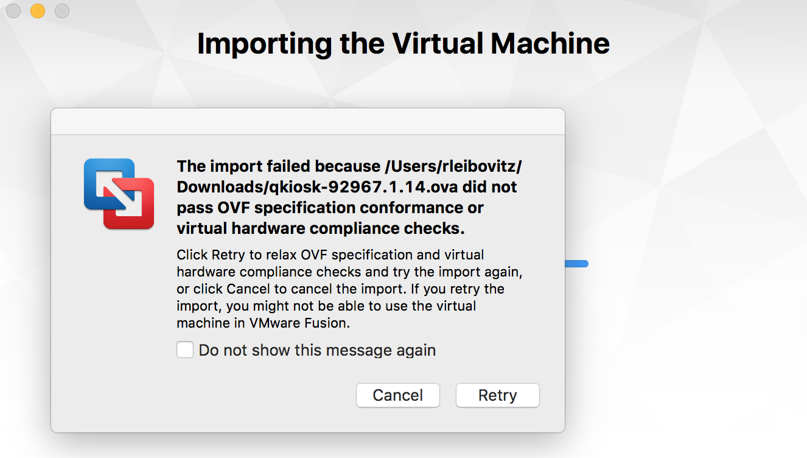

8. Ignore the message and click **Retry**.
9. VMware Fusion imports the VM.

    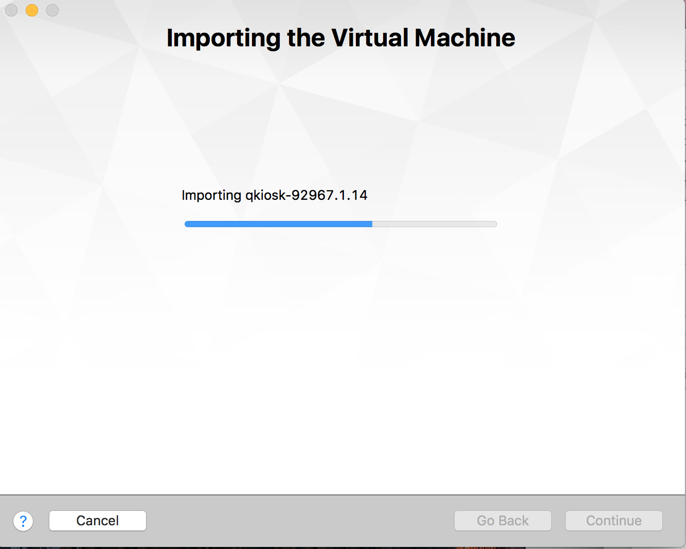

10. When the process is complete, you’ll see a summary of the VM’s settings.

    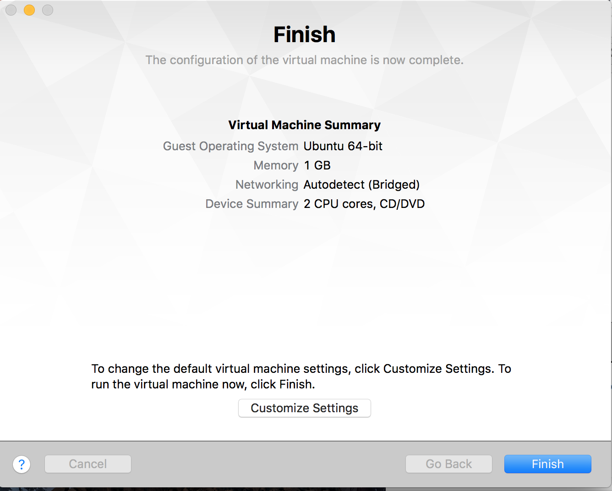

11. Click **Finish**.
12. You’re asked if you want to upgrade the VM.

    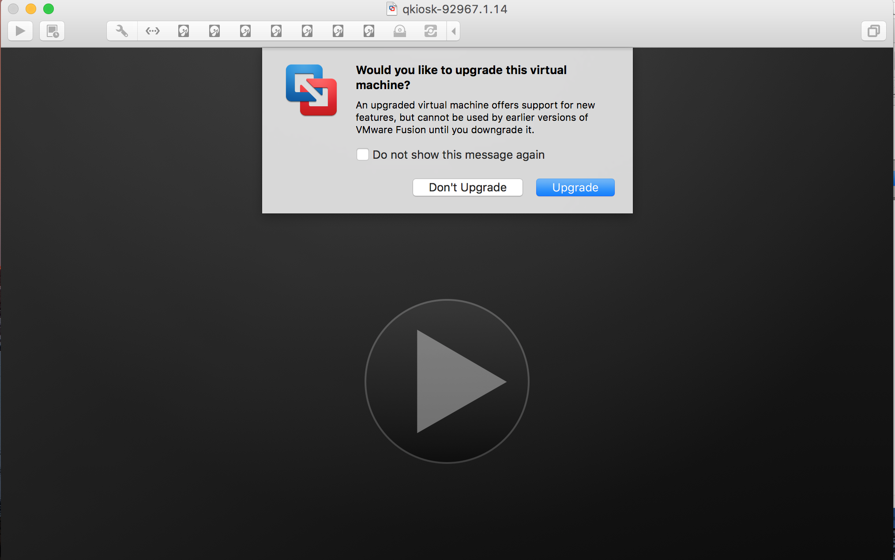

13. Click **Don't Upgrade**.
14. The VM starts and, after some code scrolls by, you see the Qumulo End User License Agreement (EULA). Scroll to the end. Select both boxes and click **Submit**.

    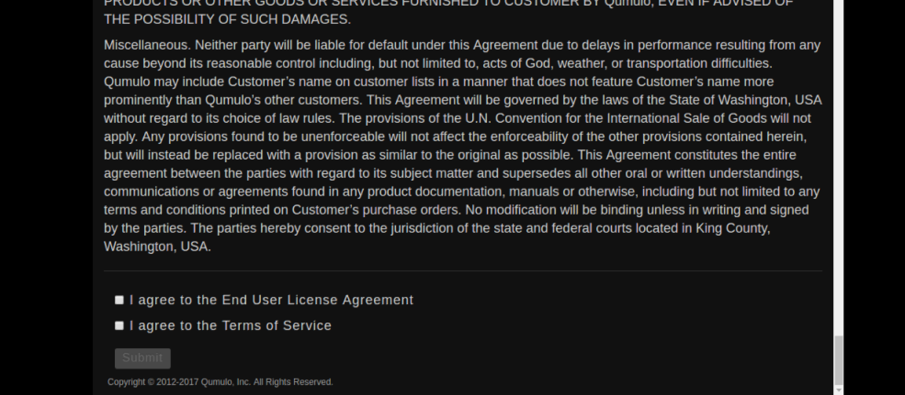

15. The Qumulo configuration page appears.

    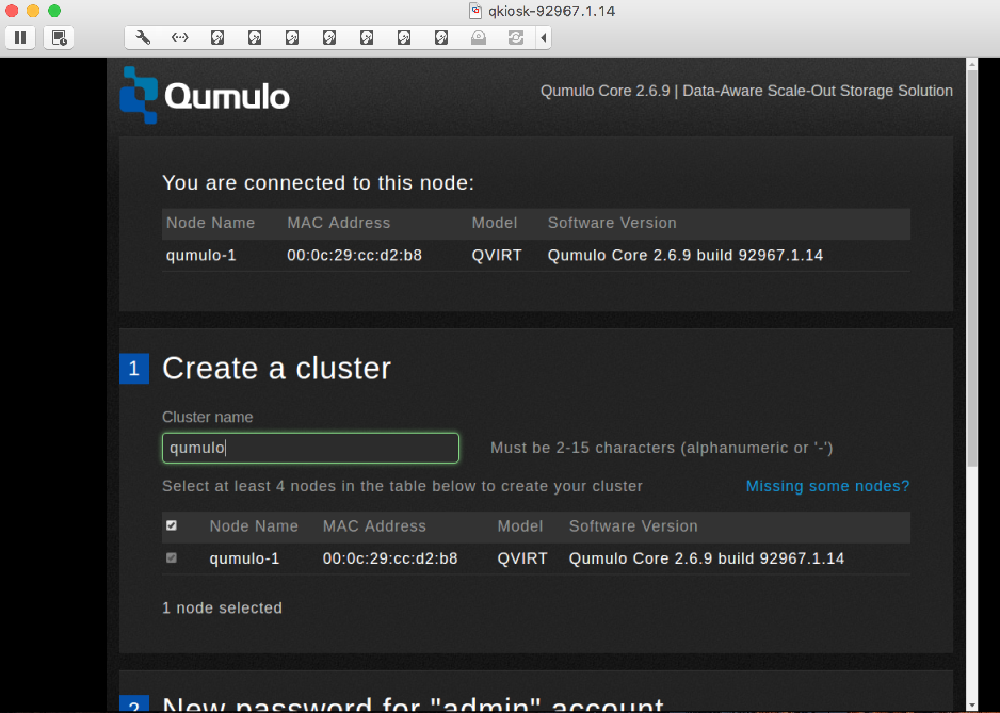

## Create the additional nodes

1. You’ve successfully created one node and you need to create three more. From the VMWare Fusion tool bar, click **File** and then click **New...**. You’ll be asked to select the installation method.

    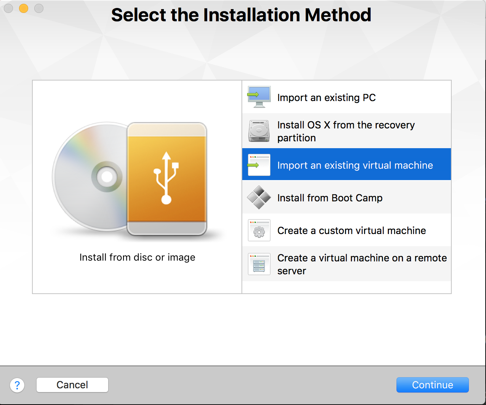

2. Click **Import an existing virtual machine**. Click **Continue**.
3. From the **Choose an Existing Virtual Machine** dialog, select the same OVA file you used before and click **Continue**. 
4. The dialog box appears. Note that the name of the new instance is automatically created and is sequential. It will be saved in the directory you specified.
5. Repeat the steps you performed for the first node. 
6. Once you’ve created the second node, create the third and fourth nodes. 
7. When you are done, the Qumulo configuration page should show that you have four nodes. They should all be selected.

    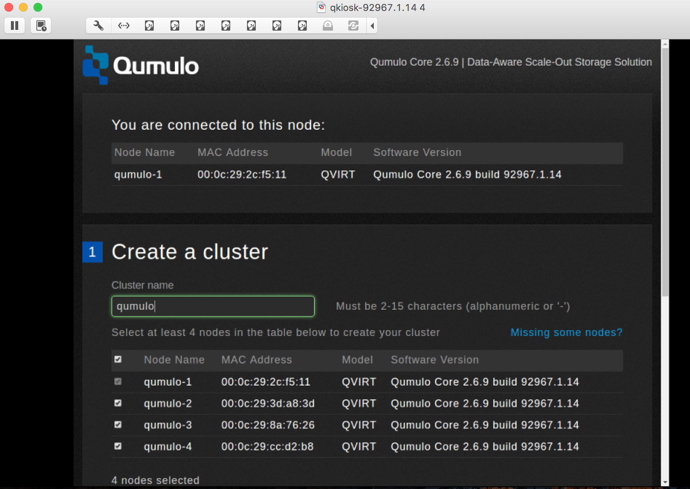

## Create a cluster

1. In this section you create your cluster. You should still be on the configuration page.
2. In the **Cluster name** field, enter a cluster name. In this example, it is qumulo-vm.

    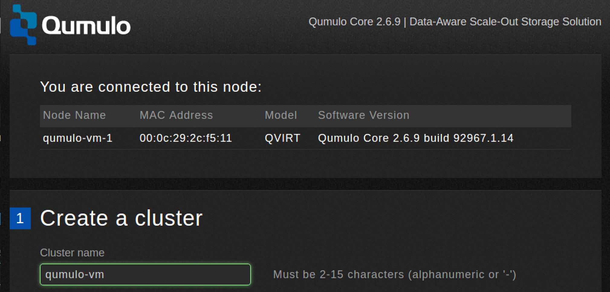

3. Scroll down and enter a password for the admin account. Make a note of it. You need it to administer the cluster.

    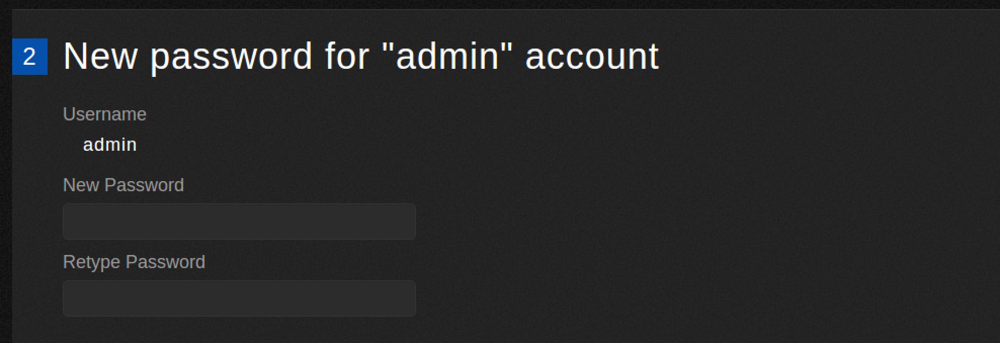

4. Click **Create Cluster**.
5. You’ll be asked for a confirmation.

    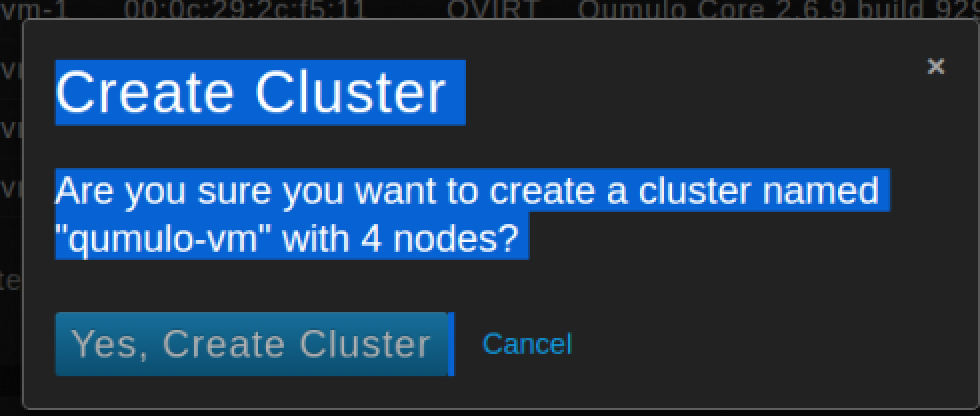

6. Click **Yes, Create Cluster**.
7. You’ll see a message saying the cluster is being created.

    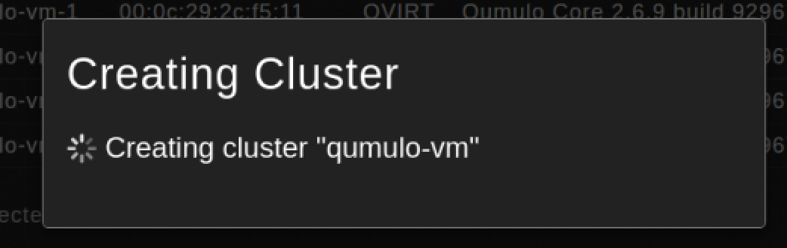

7. The Dashboard appears.

    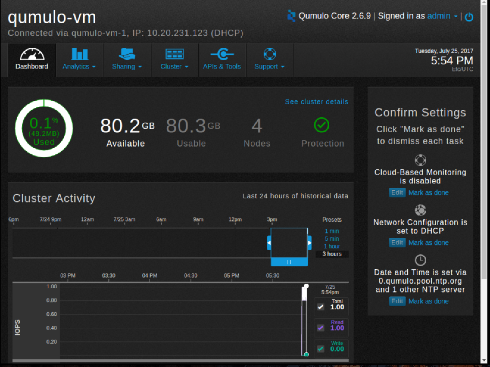

8. Note the IP address, located at the top. You can use your browser to reach the dashboard. In this example, the URL is http://10.20.231.123.

9. Your cluster is now ready to start serving data.

## What's next?

Now that you've set up your cluster, you can set up shares and exports. These tutorials will help you.

* [Create an NFS export](/resources/how-to/create-nfs-export)
* [Create an SMB share](/resources/how-to/create-smb-share)

To safely shut down your cluster, see the [Safe shutdown](/resources/how-to/safe-shutdown) tutorial. Once a cluster is shut down, you have to power on the VMs again to restart it.

