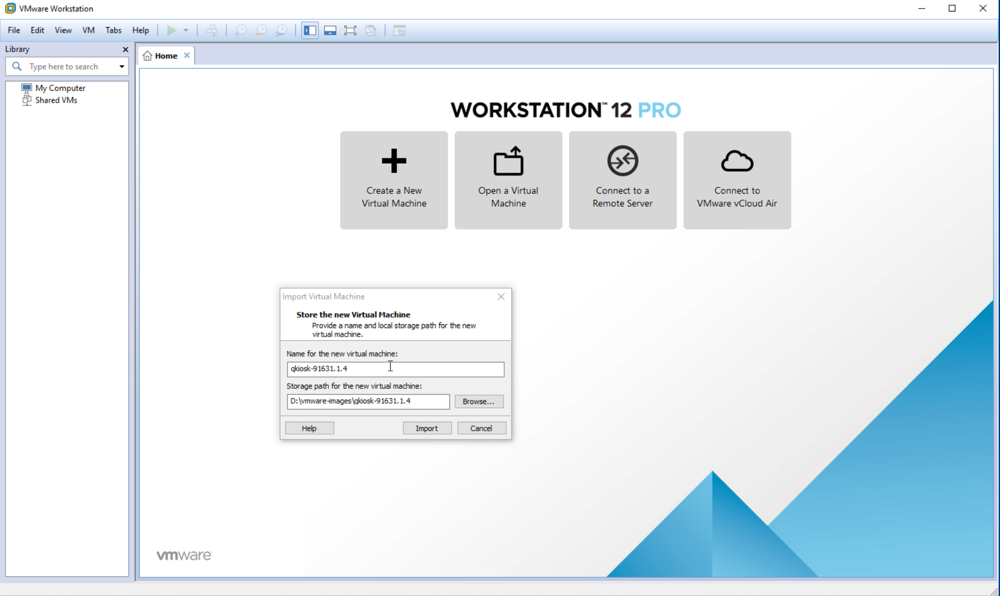

# Create a Qumulo File Fabric (QF2) virtual cluster on Windows

(This procedure assumes that you've already downloaded the .ova file. If you haven't, go [here](/evaluate/download/vm).)

In this tutorial, you’ll simulate an on-premises QF2 cluster by using VMware virtual machines (VM) to create four nodes. A cluster is a collection of nodes, where an on-premises node is a single hardware chassis (simulated in the tutorial by a VM). An on-premises cluster requires a minimum of four nodes because of the way the Qumulo block protection scheme works.

## System Requirements
Here are the system requirements.

* For best performance, we recommend at least 8GB of RAM and an SSD to host the virtual images.
You need to have VMware Fusion installed on your computer.
* You need Internet access.
* We recommend that you use the Chrome browser. The first time you access the cluster with the browser, you may get a warning that your connection is not private. If you do:
1. Scroll down and click **Advanced**.
2. Click **Proceed to *IP Address***
3. Log in to the cluster as admin.

## User requirements
The tutorials walk you through everything you need to know to set up a cluster but it’s helpful if you have some understanding of the network you’ll be using. Try to find out if your environment uses the Dynamic Host Configuration Protocol (DHCP) to assign IP addresses or if you need to assign the addresses yourself. If you do need to assign the addresses manually, collect the following information:

* The subnet mask
* The gateway
* The IP addresses of the DNS servers
* The search domains
* The maximum transmission unit (MTU)

Familiarity with VMware Fusion is helpful.

## Open the VMware File
In this section you open the VMware file. 

1. Go to the directory where you downloaded the VMware .ova file and click on it. 
2. The VMware Workstation opens.
 
    

 3. In the Import Virtual Machine dialog box, the name for the virtual machine is filled in, by default.
4. Use the default path or enter a local storage path where you want to save the VM image. If possible, save it to an SSD device.
3. Click **Import**. 
4. A warning message appears.

    

5. Ignore the message and click **Retry**.
6. VMWare Fusion imports the VM.

    

7. Once the image is imported, the VMware Workstation shows the following view. The new instance should appear in the left pane, under **My Computer**.

    

## Select networking option
1. Under **My Computeer**, click the new instance.
2. In the right pane, click **Edit virtual machine settings**.
3. The **Virtual Machine Settings** window opens.
4. Choose the appropriate networking option for your environment. Here is an example that uses a bridged connection.

    

    **Note**: NAT uses the IP address of the machine that the VMs run on and hides the internal IP addresses from your network.

    If your environment uses DHCP, then the VMs are automatically assigned IP addresses. Otherwise, you’ll need to assign the IP addresses yourself. We’ll cover this later in the tutorial. You can always change these settings but you’ll need to restart the VMs.

## Create three more VMs

You need to create three more VMs to complete your cluster. Follow the same steps as you did for the first instance. Each VM is automatically named sequentially and all the images are stored in the path you specified. Here is an example dialog box for a second VM.

    

## Power on the VMs
In this section, you power on each of the instances you've created.

1. In the VMware Workstation, under **My Computer**, you should see all four instances listed.

    

2. Select the first instance and then click **Power on this virtual machine**.

    

3. Some code scrolls by and after a few seconds, the Qumulo End User License Agreement (EULA) appears.

    

4. Scroll down to the end of the agreement, select both boxes and click **Submit**.

    

5. Under **My Computer**, select the second instance, power it on, and accept the EULA. Do the same for the third and fourth instances.

6. The Qumulo configuration page appears, showing all four instances.

    

## Create the cluster
In this section you create a cluster.

1. On the configuration page, in the **Cluster name** field, enter a name for your cluster.

2. Scroll down to set the password for the admin account.

    

3. Click **Create cluster**.

4. You're asked for a confirmation. Click **Yes, Create Cluster**. 

    

5. A message appears saying that the cluster is being created.

    

6. After a few seconds, you will see the dashboard.

    

7. If DHCP is available, then the cluster  self-assigns IPv4 addresses. In this example, the  IP address is 10.0.0.12. You can use this address to access the dashboard from your browser. The address is http://10.0.0.12.

8. If you use DHCP then congratulations! You’ve set up your cluster. Skip the following section and go to What’s Next? If you don’t use DHCP, go to the following section, “Assign IPv4 static IP addresses.” 

## Assign IPv4 static IP addresses

1. Go to the dashboard. Point to **Cluster** and then click **Network Configuration** in the drop-down list.

    

2. The Network Configuration IPv4 page opens. 

    

3. Fill in the subnet mask, the gateway, the IP addresses of the DNS servers, and the search domains. If necessary, change the MTU size.

4. Scroll down and set the static IP addresses for each node. Optionally, you can assign floating IP addresses that will be redistributed in case a node fails.

    

5. Click **Save**.

6. A message appears saying that the network configuration view is being refreshed.

    

7. The new view, with the correct information, appears.

    

8. Scroll down to see the IPv4 addresses assigned to the nodes.

## What's next?

Your cluster is now set up and ready to share data. The next step is to create exports and shares. Here are the tutorials.

* [Create an NFS export](/resources/how-to/create-nfs-export)
* [Create an SMB share](/resources/how-to/create-smb-share)

To safely shut down your cluster, see the [Safe Shutdown](/resources/how-to/safe-shutdown) tutorial. Once a cluster is shut down, you have to power on the VMs again to restart it.

 

