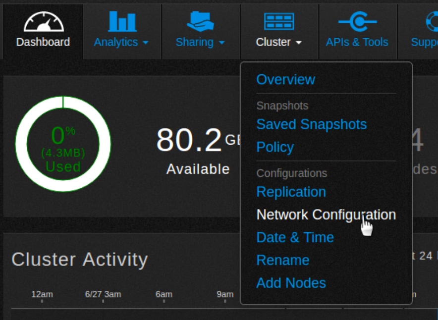
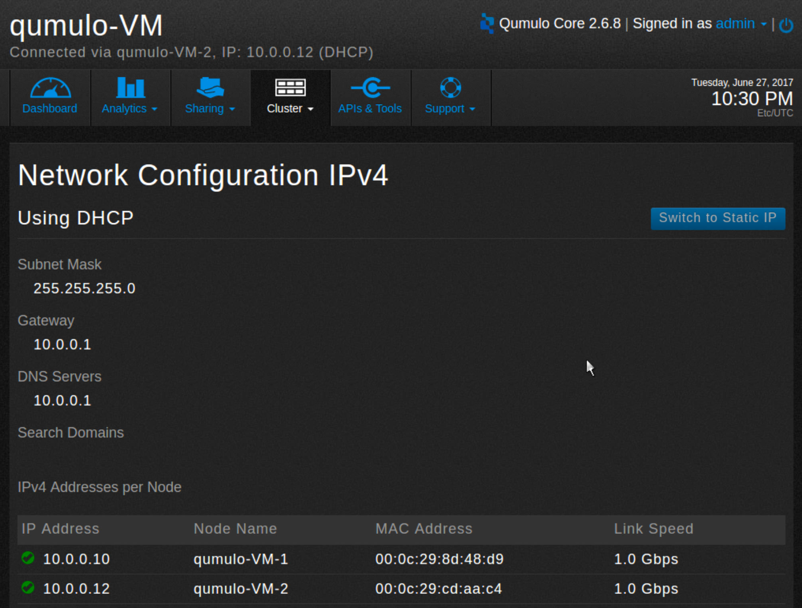
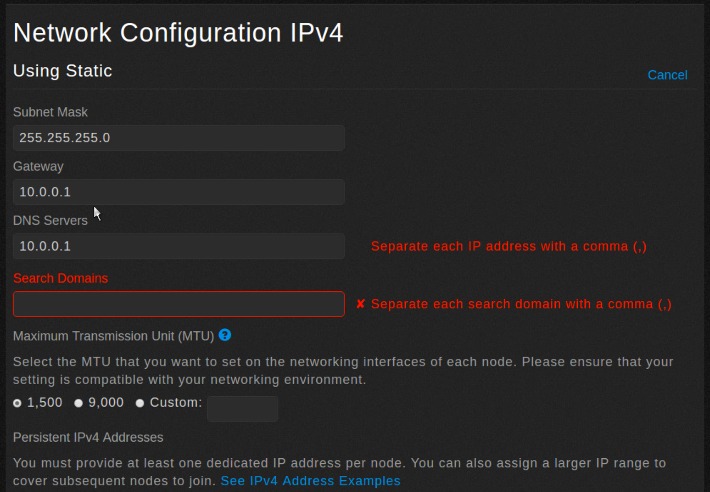
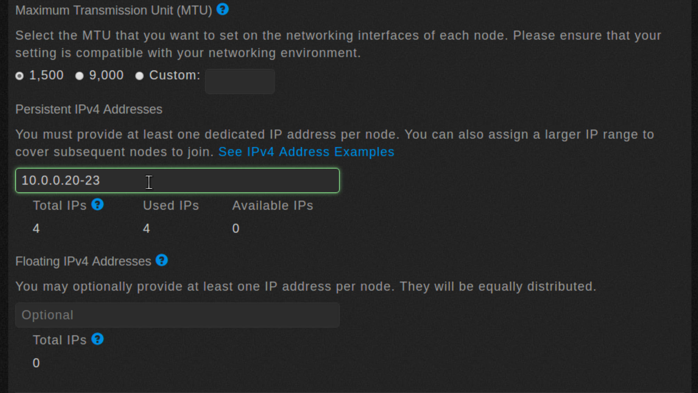
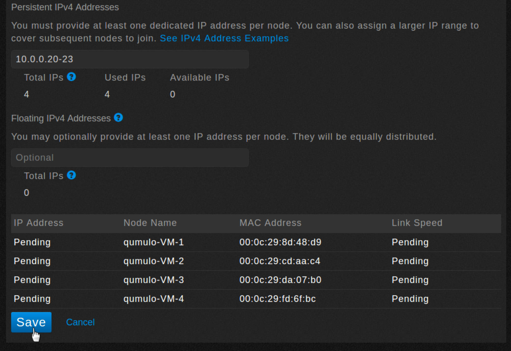
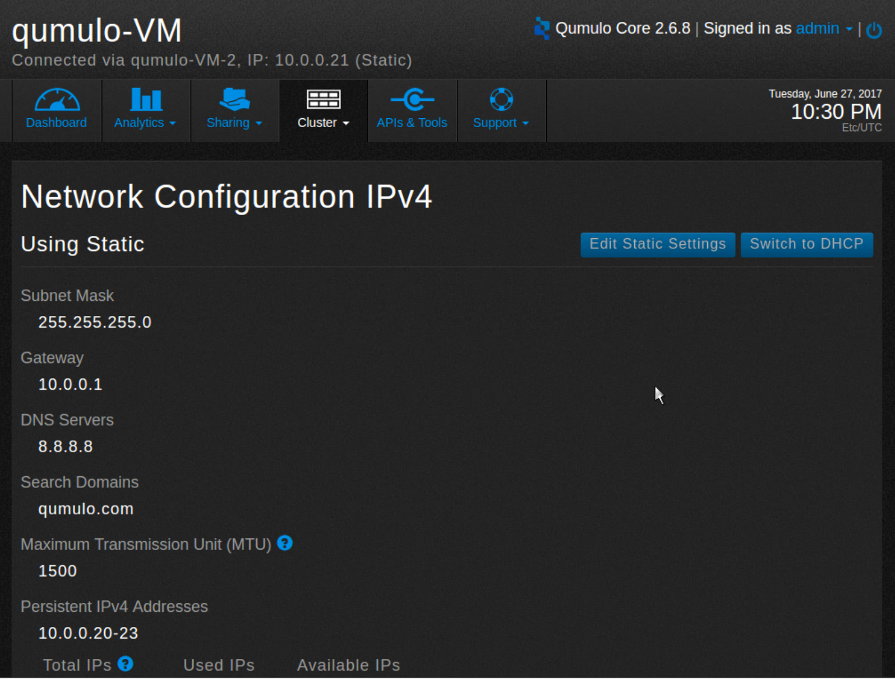
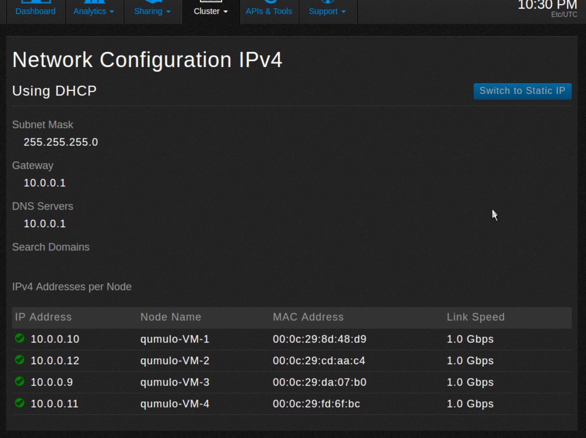

# Configure the network for static addresses

In this tutorial you use Network Configuration to manually assign IPv4 static addresses.

1. From the dashboard, point to **Cluster** and click **Network Configuration**. 

    

2. The Network Configuration screen appears. In this example, the cluster is currently configured to use DHCP.

    

3. Click **Switch to Static IP** to manually assign IPv4 static addresses.
4. The Network Configuration IPv4 screen appears.

    

5. Fill in each of the fields as appropriate and change the MTU size, if necessary.
6. Scroll down and set the static IP addresses. Use either a comma-separated list or a range, using a dash.

     

7. Optionally, you can assign floating IP addresses that will automatically be reassigned to the remaining nodes if a node fails. 

    

8. Click Save.
9. A dialog box appears

    

10. The Network Configuration IPv4 screen shows that you are now using static networking.

    

11. To change static settings, click **Edit Static Settings**.
12. To revert to DHCP, click **Switch to DHCP**.
13. The screen changes to show a pending state.

    

14. Click **Save**.
15. A dialog box appears.

    

16. The screen changes to show you are now using DHCP.

    

 
