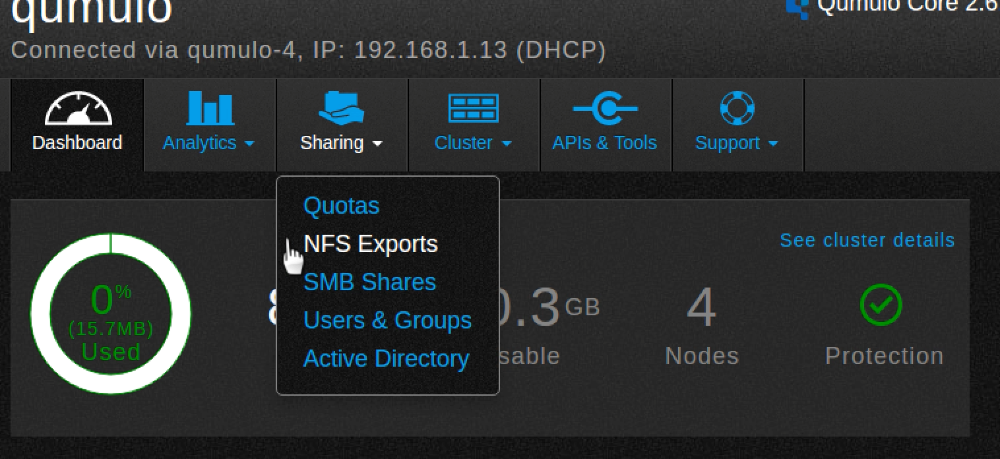
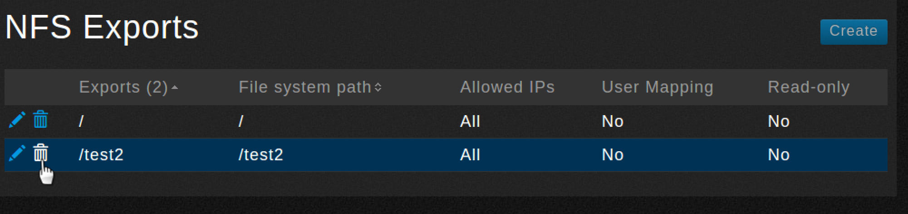

# Create an NFS Export

In this tutorial, you’ll use the QF2 dashboard to create a Network File System (NFS) export. The export allows NFS clients to share data stored in a particular directory.

1. Log in as admin if you need to.
2. The dashboard appears.
3. Point to **Sharing** and then click **NFS Exports** from the drop-down list.

4. You should see the NFS Exports page, which lists the available exports.

5. Click **Create**.
6. An NFS Export dialog box appears.

7. You must fill in all the required fields. Here are the definitions:

* **File system path**. The path to the directory to be exported.
* **Create new directory with inherited permissions**. If selected, creates a new directory if the file system path does not exist.
* **Export path**. The NFS export name that will be mounted by clients.
* **Description**. A description of  the export (optional field).
* **Allowed IPs**. A list of IP addresses that the export can be restricted to. The default is to allow all IP addresses access to the export (optional). 
* **User mapping**. Forces user IDs to be mapped to a specific ID. The **No mapping** option is the default.
* **Read-only**. By default, the export is read-writeable. If you select **Yes**, it is only readable.

>Here is an example. The directory test2 will be created on the file system and exported as test2. There is no user mapping and the export will be read-writeable. There are no IP access restrictions.

8. Click **Save**.

9. Once the operation completes, the newly created export appears on the NFS Exports list.

## Edit exports

You can edit an export's properties. 

1. On the NSF Exports page, click the pencil icon next to the share you want to edit.

2. The NFS Export dialog box opens.
3. Click **Save** when you are done editing.

## Delete exports
You can delete an export.

1. On the NFS Exports page, click the trashcan icon next to the export you want to delete.

2. You will be asked to confirm the deletion.

3. Click **Yes, Delete Export** to confirm the deletion or click **Cancel** to keep the export.

