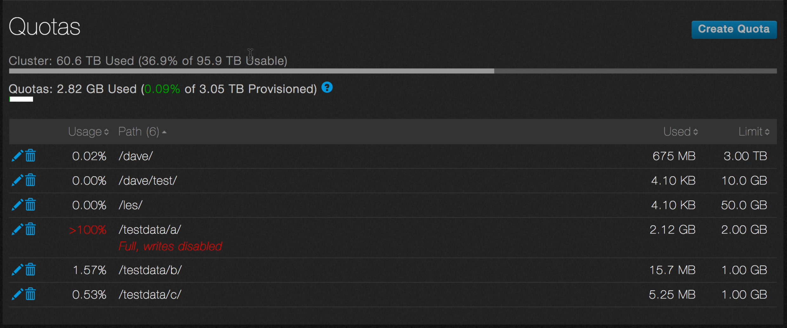

# Create a quota

In this tutorial, you’ll use the QF2 dashboard to create a quota. Quotas allocate specific amounts of storage to specific directories. Quotas in QF2 Core are dynamically updated and take effect immediately. They can be applied to any directory, even nested ones. If there is more than one quota because of nested directories, all quotas must be satisfied in order to allocate the requested space.

Quotas are enforced in real time. If a directory fills to the limit of a quota (or a quota is applied to an existing directory with more data than is allowed by the quota) no additional data can be written to the directory.

## Go to the Quota main page

1. Log in to your cluster as admin.
2. The dashboard appears.
3. Point to **Sharing** and then click **Quotas** from the drop-down list.

4. The Quota page opens.

Under Quotas are two bar graphs that give you information about the cluster and quotas. The top graph shows the amount of storage in the cluster that’s already been used and what percentage of usable storage is available.

The bottom graph shows the amount of storage that’s been used in quotas and what percentage that is of the total percentage of storage provisioned for quotas. 

The Quotas Used calculation is the sum of used capacity across all quotas. The Quotas Provisioned calculation is the sum of all quota limits.

When the parent directory of a quota also has a quota provisioned, only the parent quota is included in the calculation.

Under the bar graphs is a list of the currently provisioned quotas.

## Create the Quota
In this procedure, you create a quote through the dashboard. You should still be on the Quotas page.

1. Click **Create Quota**.

2. The Create Quota dialog box opens.

3. Enter the directory path where you will apply the quota. The directory must already exist.
4. Enter the size of the quota and, if necessary, select the unit, either gigabyte(GB), terabyte(TB) or petabyte(PB).

In this example, a 1GB quota will be created on the directoy /testdata/a.

5. Click **Save**.
6. The quota appears on the list of provisioned quotas.

## Quota limits
When a directory exceeds its quota, it turns red.

In this example, /testdata/a is using 2.12GB of storage, which exceeds the 2.00GB limit. No more data can be written to this directory. You must either move or delete data to bring the directory back into compliance.

Once the data is gone from the directory, its name is displayed normally.

Remember, QF2 gives you real-time visibility and control over your file system. You are seeing the current state of the system.

## Edit quotas

You can edit a quota by changing its size.

1. On the Quotas main page, click the pencil icon next to the directory whose quota you want to change.

2. The Edit Quota dialog opens.

3. Change the size of the quota.
4. Click **Save** to save the change or click **Cancel** to discard it.

## Delete quotas
You can delete a quota on a directory.

1. On the Quotas main page, click the trashcan icon next to the directory whose quota you want to delete.

2. You will be asked to confirm the deletion.

3. Click **Yes, Delete** to confirm the deletion or click **Cancel** to keep the quota.

