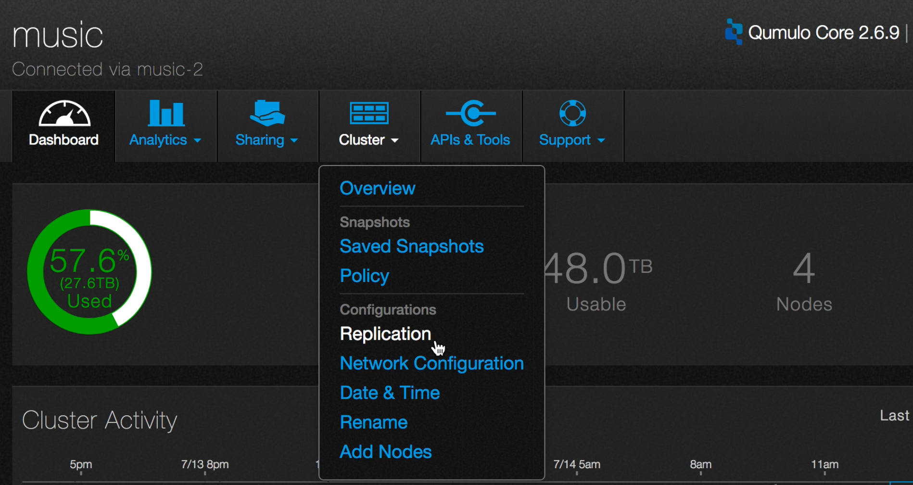
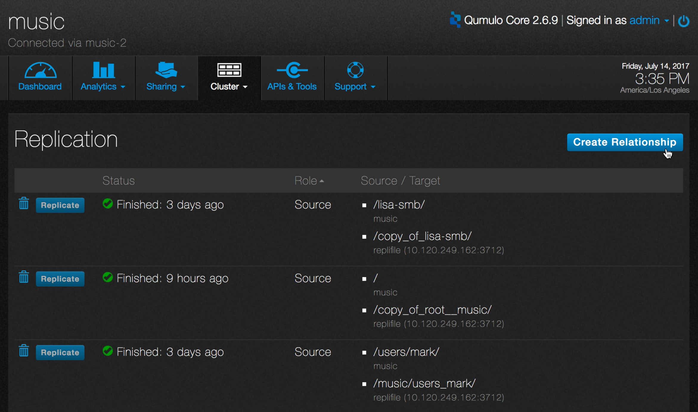
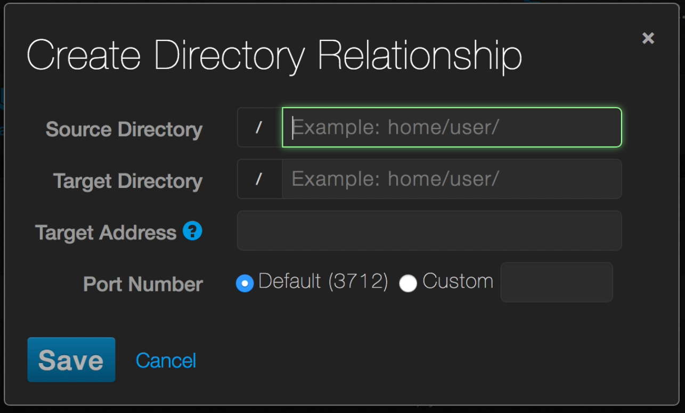
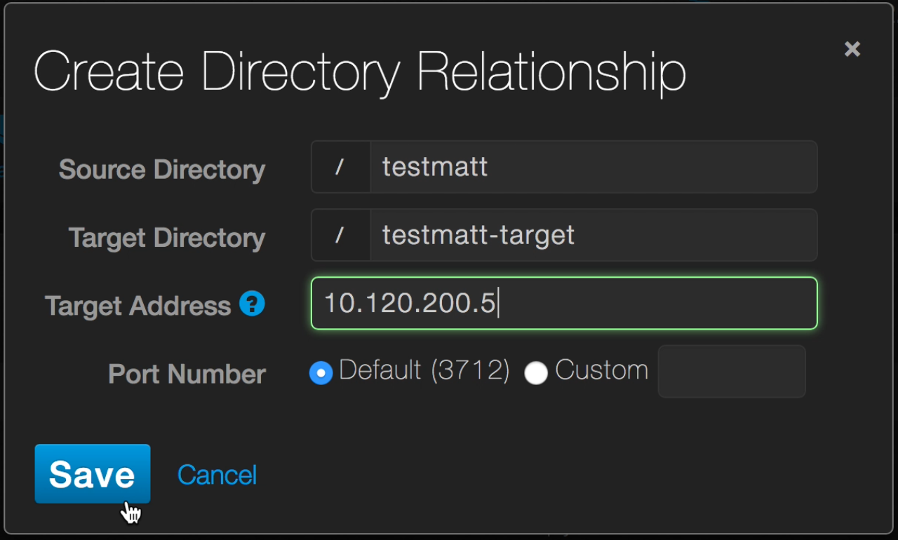
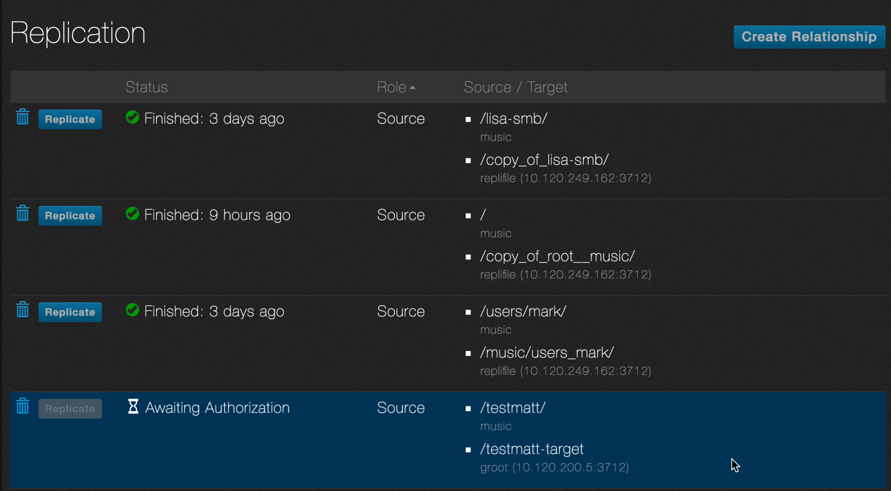
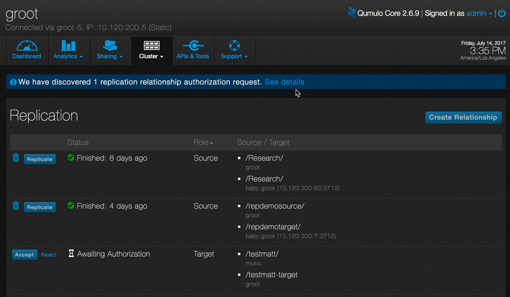
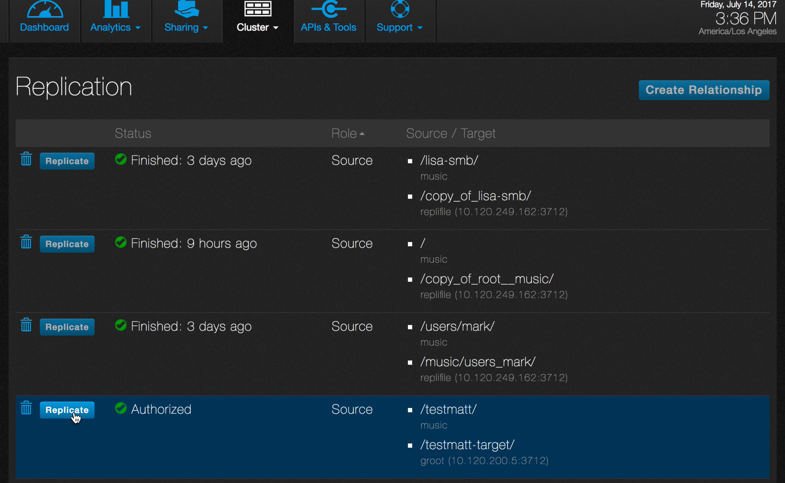
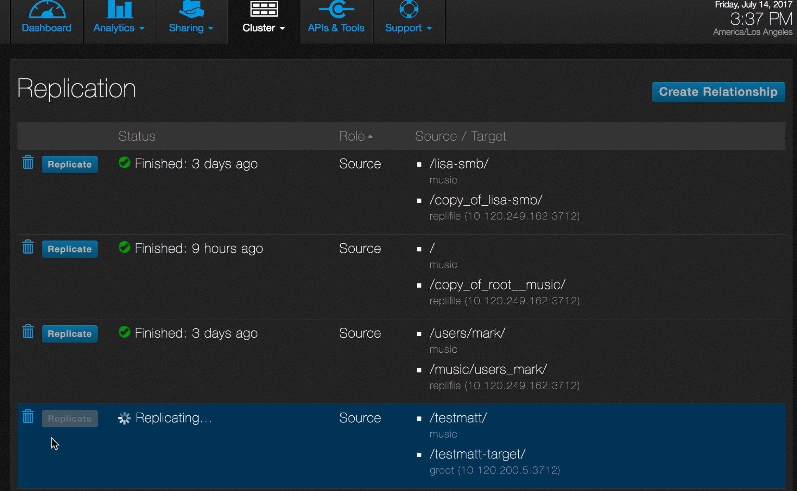
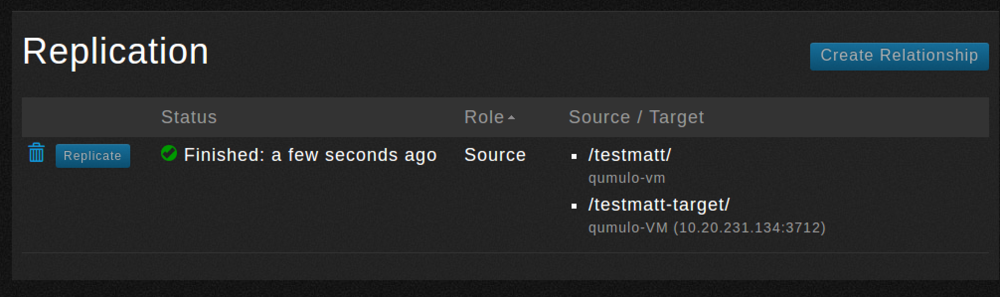
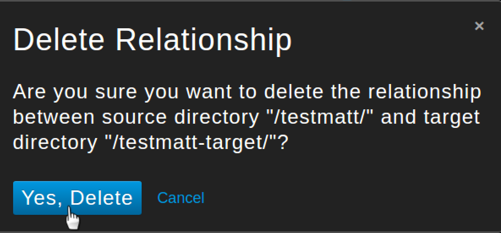

# Replication

This tutorial shows you how to replicate data by using the QF2 dashboard. Replication copies data between two or more QF2 clusters at a directory level. In this tutorial, you'll copy data from one cluster to another, so you'll need two clusters. You can set up a cluster on another machine or on AWS. These tutorials can help you.

* Set up a virtual cluster on a Windows machine
* Set up a virtual cluster on a Mac
* Set up a cluster on AWS

You replicate data by defining a *policy*, where a policy defines a relationship between a *source*, which is the directory where the data lives on one cluster, and a *target*,which is the directory on another cluster where you will copy the data to. 

## Open the replication page

1. Log in to the cluster.
2. Point to **Cluster** and click **Replication**.

3. The **Replication** page opens.

4. The page lists any existing policies, with some information about each one. 

* **Status.** The last time the replication policy completed. While a replication is in process, the status is **Replicating...**.
* **Role**. Whether the cluster is a source or a target for this policy. 
* **Source / Target**. The source directory and the target directory.

## Create a policy

In this section, you'll create a new replication policy by establishing a relationship between two directories on two different clusters.

1. On the **Replication** page, click **Create Relationship**.

2. The **Create Directory Relationship** dialog opens.

3. You must fill in all the fields. Here are the definitions:

* **Source Directory**. The directory on the cluster that is the source of the data. The directory must already exist.
* **Target Directory**. The destination directory on the target cluster that the data will be replicated to. The directory must already exist.
* **Target Address**. The IP address of one of the nodes of the target cluster. (In a production environment, to ensure resilience, use floating IPs instead of static IPs.) 
* **Port Number**. The port used for replication. The default is port 3712. 

Here is an example.

The source directory on the originating cluster is **testmatt**. The target directory is **testmatt-target** on the destination cluster. The IP address of one of the nodes on the destination cluster is **10.120.200.5**. The default port is being used.

4. Click **Save**.

5. The **Replication** page appears. The new policy is included in the list. Its status is **Awaiting Authorization**. The policy must be approved on the target cluster.

6. Log in as admin on the target cluster.
7. Navigate to the **Replication** page, just as you did before.
8. At the top of the page is a notification that there is an authorization request. The new policy is listed with a status of **Awaiting Authorization**.

9. Click **Accept** to authorize the relationship. (If the directory does not exist, a warning appears at the top of the **Replication** page. Create the directory and click **Accept** again.)
10. The status changes to **Authorized**.
11. Go back to the **Replication** page on the source cluster.
12. The status is now **Authorized** (this may take a few seconds).

## Start replication
In this section, you start the replication process.

1. On the **Replication** page of the source cluster, find the newly authorized policy and click **Replicate**.

2. The status changes to **Replicating**.

3. When replication is complete, the status changes to **Finished**, with a timestamp.

## Delete a policy
In this section you delete a policy from the list on the **Replication** page.

1. Click the trashcan icon next to the policy name you just created.

2. You will be asked for a confirmation.

3. Click **Yes, Delete**.

There are many other QF2 features to explore. Here are some suggestions.

* Analytics
* Snapshots
* Quotas

 

