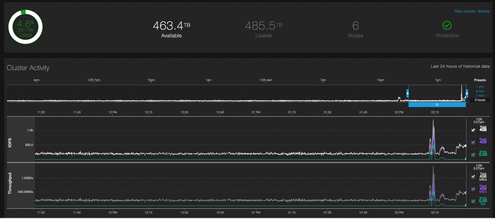
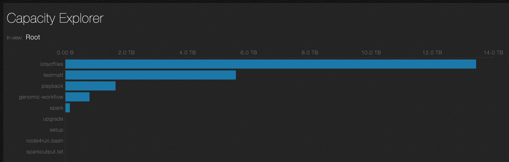
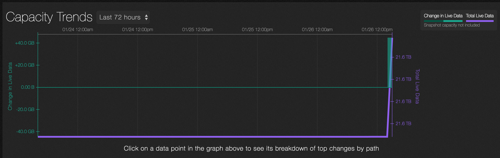
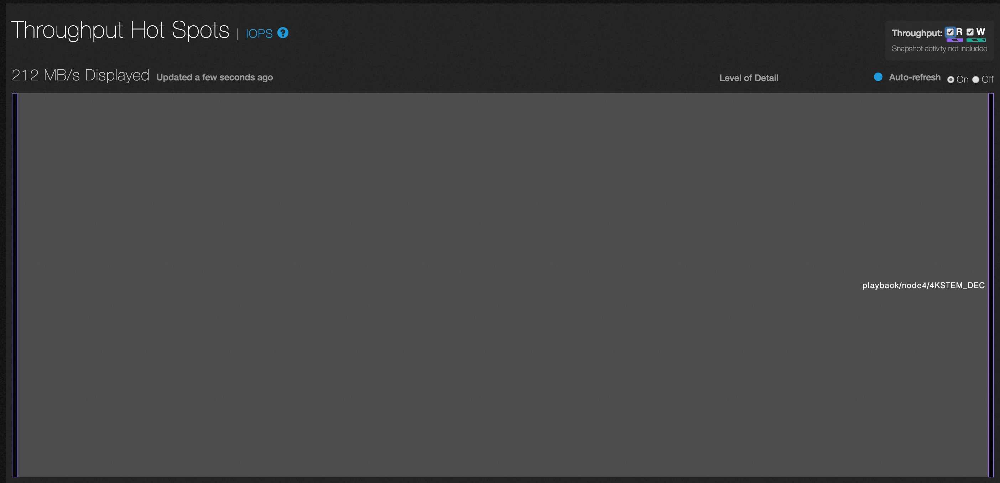
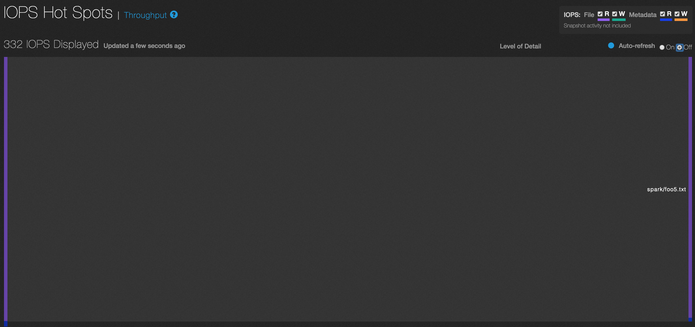
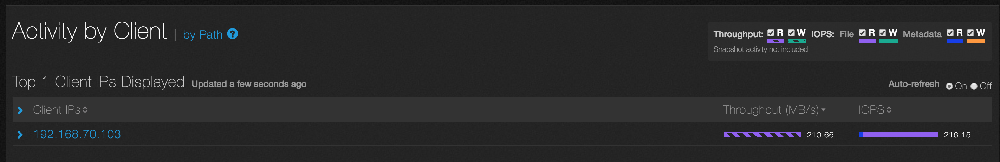
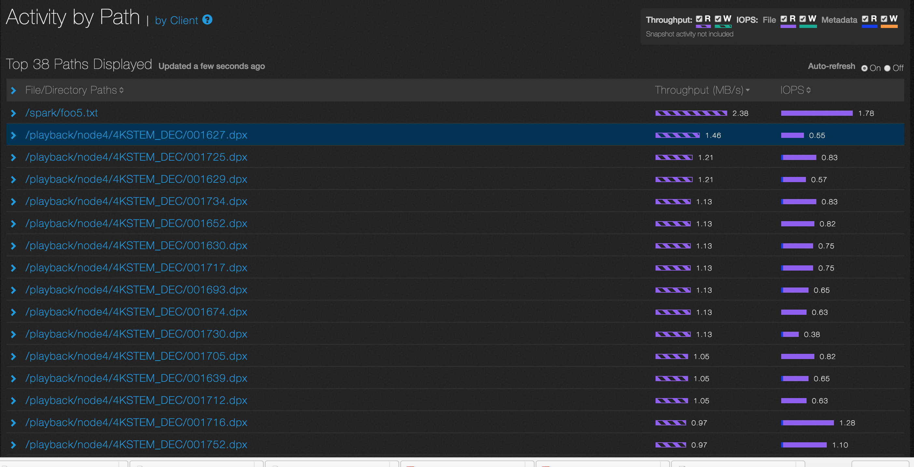

# See It at Scale

This walkthrough is an overview of the See It at Scale cluster. To access the cluster, you need to log in to the Qumulo web site and get your credentials. (The **Log In** link is at the upper-left hand of the screen.)

The See It at Scale cluster is a live QF2 cluster that consists of six QC104 nodes with 485.5TB usable (624TB raw) capacity. Over 3.2 billion files exist on the file system. Four Linux clients generate varying amount of IOPS and throughput, depending on the workflow.

## Sample workflows

Currently, there are three different workflows running on the cluster.
1.	Continuous playback of over 6000 sequential 50MB .dpx image files to simulate a movie sequence.
2.	Genomic processing of actual human genomic data.  Raw .fasta files are processed and aligned in parallel.
3.	Spark-based analytics where the four clients use Spark to count the words in a 125GB text file.

The workflows automatically cycle. You can identify which workflow is running by examining the file structure. No workflow takes longer than 10 minutes, so if you’re patient you’ll be able to see them all.

## Getting Started
To get started, log in with the credentials you received. You will see the dashboard.  Here is an example.

The dashboard gives an overview of cluster activity over the last 24 hours. IOPS and throughput are graphed at the bottom, with reads in purple and writes in green.

Varying amounts of cluster activity are shown. The detailed zoom window can be adjusted by grabbing the blue slider and dragging either arrow to expand or contract the detail. It can also be scrolled over different time periods from the last 24 hours.

## Exploring Analytics

In this section, you’ll look at some of the analytics that are available. If you want more help, you can look at the tutorials and videos on the [Try QF2 Now](https://qumulo.com/evaluate/tutorials/) page.

Point to the  **Analytics** tab and click **Integrated Analytics**. Here is an example of what you’ll see.

The screen displays, in real time,  the most “interesting” things happening with the cluster.  Throughput and IOPS (both file and metadata) are represented as bars in the directories where activity is occurring.  If you click in one of the directories, you’ll see that the most active clients and directories are displayed on the left.

1.	Click in the root directory. (It’s the largest block and the furthest to the left.)
2.	What are the most active clients? 
3.	What are the most active paths?
4.	How many files are there?
5.	How many directories are there?

You can focus on specific types of access by unchecking the boxes on the upper right. Try and change the display so only Metadata activity is represented.

Note how quickly all this information becomes available. QF2 doesn’t need to do a treewalk to generate this information.  Experiment and try clicking on other directories to learn more about the file system.

## Using the Capacity Explorer

The capacity explorer lets you see which directories contain the most data. 

Point to **Analytics** and click **Capacity Explorer**. Here is an example of what you’ll see.

1.	Which directory contains the most data?
2.	Click on any directory and explore the file system. You can drill down all the way to the file level.

## Using Capacity Trends

Capacity trends gives you an historical view of how storage is being used over time. 

Point to  **Analytics** and click **Capacity Trends**. Here is an example of what you’ll see.

The selector lets you choose from trends over the last 72 hours, 30 days, or 52 weeks.

1.	Click on any of the vertical green bars to get a breakdown of the files that were either added or deleted.
2.	Is the storage capacity trending up or down (look at the purple line)?

## Locating Throughput Hot Spots

You can easily identify throughput hot spots.

Point to **Analytics** and click **Throughput Hot Spots**. Here is an example of what you’ll see.

Which directory has the most throughput?  Is the throughput reads (purple)or writes (green)?

## Locating IOPS Hot Spots

You can easily locate IOPS hot spots.

Point to **Analytics** and click **IOPS Hot Spots**. Here is an example of what you’ll see.

 

Note that both file and metadata IOPS are shown.

1.	Which directories have the highest number of IOPS?
2.	Which directories have the highest file reads (purple)?
3.	Which directories have the highest writes (green)?
4.	Which directories have the highest metadata reads (blue) or writes (orange)?

## Identifying Activity by Client

You can easily identify which clients are the most active. 

Point to **Analytics** and click **Client**. Here is an example of what you’ll see.

The clients with the most activity are displayed. Click on any client and it will expand to show the most active directories.

Which client is most active and what directories is it accessing?

## Identifying Activity by Path

You can easily identify which paths are most active.

Point to **Analytics** and click **Path**. Here is an example of what you’ll see.

The most active paths are displayed.  Click on a path and you’ll see the client that’s accessing it.  

Feel free to explore the cluster and see how it handles the different workloads. Get a sense of how quickly you can get information. Can you get comparable information in real time with the system you’re using now? Don’t forget the [tutorials](https://qumulo.com/evaluate/tutorials/) page, which will show you how to set up a demo cluster of your own, either on your computer or in AWS. 

