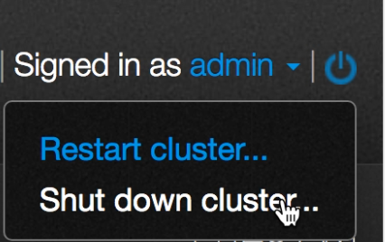
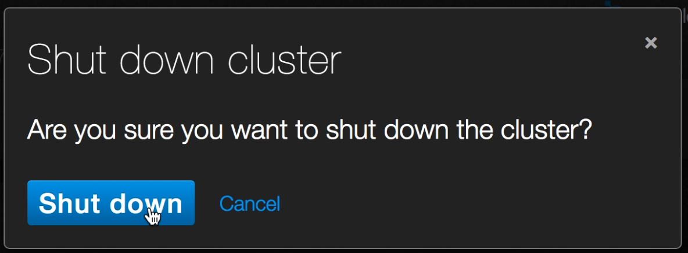

# Safe Shutdown
This procedure shows you how to safely shut down your cluster.

1. Log in as admin.
2. Click the power icon in the upper right hand corner.
3. Click **Shut down cluster...**

4. You'll be asked for verification.

5. Click **Shut down**.
6. After a few moments, depending on the size of the cluster, all the nodes will shut down.