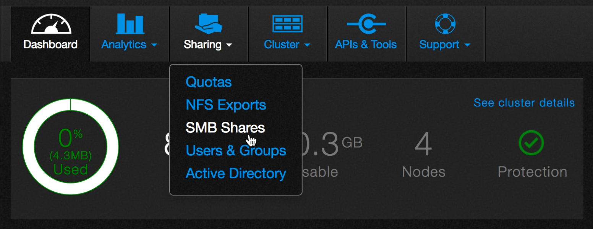

# Create an SMB Share

In this tutorial, you’ll use the QF2 dashboard to create a Server Message Block (SMB) share. The share allows SMB clients to share data stored in a particular directory.

1. Log in as admin if you need to.
2. The dashboard appears.
3. Point to **Sharing** and then click **SMB Shares** from the drop-down list.

4. You should see something similar to this screen, which lists the available shares. 

In this example, there are no shares.

5. Click **Create**.
6. The SMB Share dialog box appears.

7. You must fill in all the required files. Here are the definitions.

* **File system path**. The path to the directory to be shared.
* **Create new directory with inherited permissions**. If selected, creates a new directory if the file system path does not exist.
* **Share name**. The SMB name for the share.
* **Description**. A description of the share (optional).
* **Allow guest**. Enables the share to be accessed anonymously. The default is **No**.
* **Read-only**. The default is **No**.
* **Enable access-based enumeration**. Displays only the files and folders that a user has permissions to access. If a user does not have Read (or equivalent) permissions for a folder, the folder is hidden from the user’s view. The default is **No**.

>Here is an example that creates a new directory named **testshare**. It allows guests, is read-writeable, and does not have access-based enumeration.

8. Click **Save**.

Once the operation completes, the newly created share appears on the SMB Shares list.

## Edit shares

You can edit a share's properties. 

1. On the SMB Shares page, click the pencil icon next to the directory whose quota you want to change.

2. The SMB Share dialog box opens.
3. Click **Save** when you are done editing.

## Delete shares
You can delete a share.

1. On the SMB Shares page, click the trashcan icon next to the share you want to delete.

2. You will be asked to confirm the deletion.

3. Click **Yes, Delete** to confirm the deletion or click **Cancel** to keep the share.

