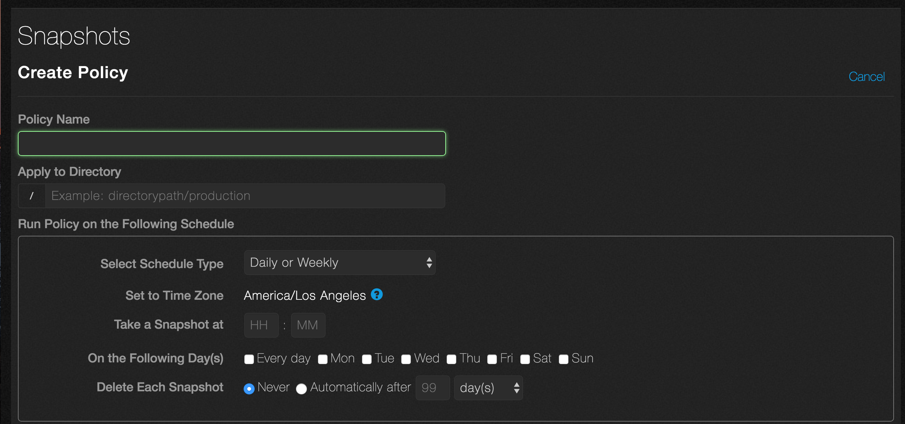
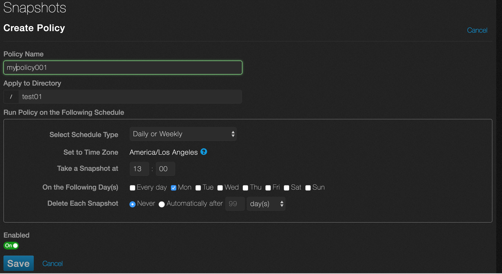
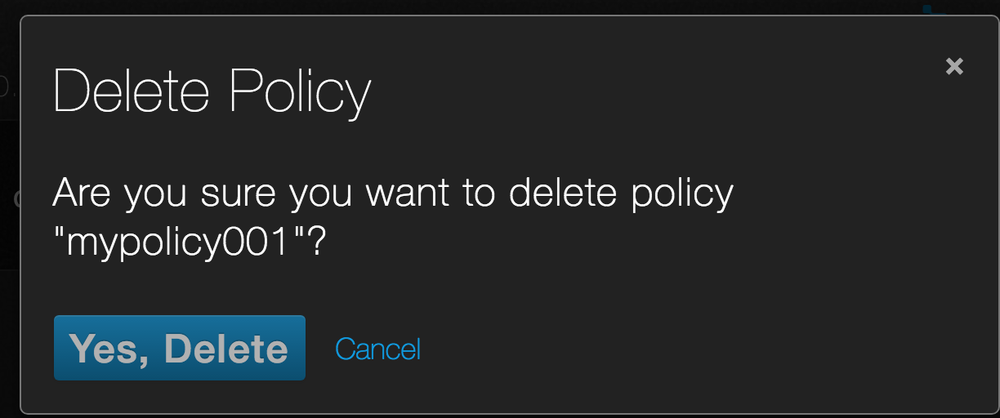

# Create a snapshot
Snapshots let you preserve the state of a directory at a given point in time. If a file or directory is modified or deleted unintentionally, you can use the snapshot to revert it to its saved state. This tutorial shows you how to take a snapshot on demand or by setting a policy, which is a schedule that automatically takes snapshots at the times you specify.

## Create a snapshot on demand
In this section, you’ll take an on-demand snapshot.

1. Log in as admin if you need to.
2. The dashboard appears.
3. Point to **Cluster** and click **Saved Snapshots** from the drop-down list.

4. You see the Snapshots page and the list of snapshots that have already been taken. In this example, the list is empty.

5. Click **Take Snapshot**.
6. The **On Demand Snapshot** dialog box appears.

 

7. Fill in the fields. Here are the definitions.
* **Snapshot Name**. The name of the snapshot.
* **Apply to Directory**. Enter the name of the directory you want to snapshot.
* **Delete Snapshot**. Schedule when you want the system to delete the snapshot. The default is **Never**. To delete the schedule, automatically,select **Automatically after**. The next field is the amount of time and the last field is a drop-down list with possible units of time (hours, days, weeks, months). 

Here is an example.

In this example, an on-demand snapshot named snapshot--001 will be taken of directory /test01. The snapshot is never deleted automatically.

8. Click **Save**. This takes the snapshot.
9. The **Snapshots** page appears with the name of the snapshot, when it will be deleted (if ever) and its policy, which is **On Demand**.

## Delete a snapshot
You can delete snapshots.

1. On the **Snapshots** page, make sure you’re on **Saved Snapshots**. Click the trashcan icon next to the snapshot you want to delete.

2. You'll be asked for a confirmation.

3. Click **Yes, Delete Snapshot**.

## Recover a Snapshot
Recovering a snapshot can’t be done from the GUI. See [Snapshots: Recovering Files](https://care.qumulo.com/hc/en-us/articles/115007121127-Snapshots-Recovering-Files) for the procedure.

## Create a snapshot policy
In this section, you’ll create a policy for taking snapshots automatically.

1. On the **Snapshots** page, click **Policy**. (You can also access the **Policy** page directly from the dashboard. Point to **Cluster** and click **Policy** from the drop-down list.)
2. You see the **Snapshots** page, which lists the existing policies. In this example, the list is empty.

3. Click **Create**. 
4. The **Create Policy** dialog appears.

5. Fill in the fields. Here are the definitions.
* **Policy Name**. The name of your policy.
* **Apply to Directory**. The directory to snapshot.
* **Run Policy on the Following Schedule**. These fields define the schedule for taking snapshots.
  * **Select Schedule Type**. Defines how often the snapshot is taken. Select the interval from the drop-down list (Hourly or Less, Daily or Weekly, Monthly).
  * **Set to Time Zone**. This field is automatically set to your operating system’s time zone.
  * **_Variable fields_**. The next few fields change, depending on the schedule type. They allow you to set the times and days when you take a snapshot.
  * **Delete Each Snapshot**. Schedule when you want the system to delete the snapshot. The default is Never. To delete the schedule, automatically, select Automatically after. The next field is the amount of time and the last field is a drop-down list with possible units of time (hours, days, weeks, months).

Here is an example.

In this example, the policy name is mypolicy001. It snapshots the directory /test01. Every Monday, the system takes a snapshot at 13:00 hours and never deletes it.

6. The **Enabled** switch should be **On**. (To disable the policy, click it to turn it **Off**.)
7. Click **Save**.
8. The **Snapshots** page appears with a summary of the policy.

## Edit a snapshot policy
You can edit a policy’s attributes. 

1. On the **Snapshots** page, make sure you’re on **Policy**.
2. Click the pencil icon next to the policy you want to change.

3. The **Edit Policy** dialog box opens.
4. Make the changes you want and click **Save**.

** Delete a snapshot policy
You can delete snapshots.

1. On the **Snapshots** page, make sure you’re on Policy.
2. Click the trashcan icon next to the policy you want to delete.

3. You will be asked to confirm the deletion.

4. Click **Yes, Delete**.

## Seeing Total Snapshot Space Used
You can see how much total space the snapshots take up from the GUI.

1. Point to **Cluster** and click **Overview**.
2. The GUI shows how much space the snapshots use. Here is an example.

 
